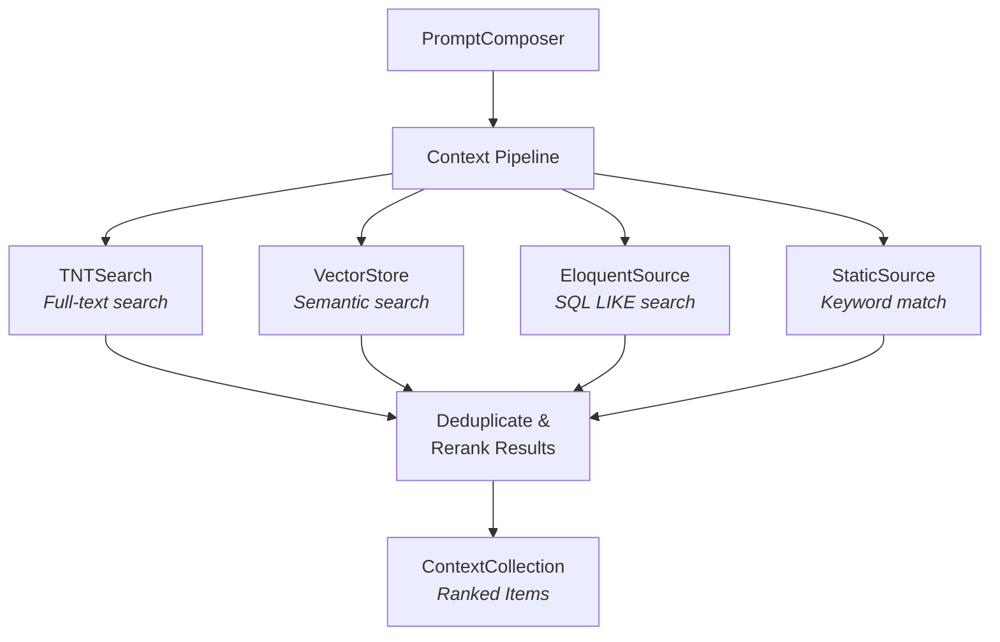
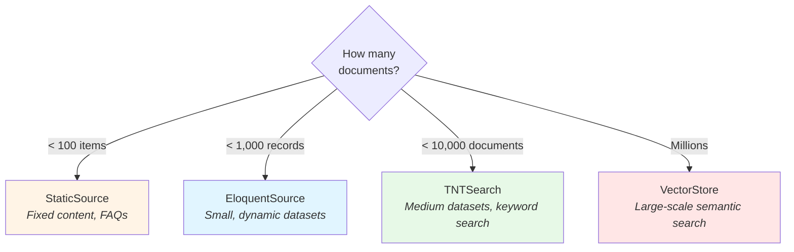

# Context Discovery

Context Discovery is one of the four core pillars of Mindwave, providing intelligent context aggregation from multiple sources for your AI applications. It enables you to pull relevant information from TNTSearch indexes, vector stores, databases, and static files, then inject it into LLM prompts using a flexible pipeline architecture.

## Overview

Context Discovery allows you to:

-   **Search multiple data sources** - TNTSearch (full-text), Vector Stores (semantic), Eloquent (database), Static (hardcoded)
-   **Aggregate and rank results** - Combine sources with deduplication and re-ranking
-   **Integrate seamlessly** - Works natively with PromptComposer for token-aware context injection
-   **Scale to production** - Built-in observability with OpenTelemetry tracing

### Architecture

Context Discovery uses a **pipeline architecture** where multiple context sources can be combined:



## Quick Start

Here's a simple example searching through documentation and injecting it into a prompt:

```php
use Mindwave\Mindwave\Facades\Mindwave;
use Mindwave\Mindwave\Context\Sources\TntSearch\TntSearchSource;

// Create a searchable source from an array
$docsSource = TntSearchSource::fromArray([
    'Laravel is a PHP web framework with expressive syntax',
    'Vue.js is a progressive JavaScript framework',
    'Python Django is a high-level web framework',
]);

// Search and inject into prompt
$response = Mindwave::prompt()
    ->context($docsSource, query: 'PHP framework')
    ->section('user', 'Tell me about PHP frameworks')
    ->run();
```

The query automatically searches the source, ranks results by relevance, and injects the top matches into the prompt context.

## Context Sources

Context Discovery provides four types of sources, each optimized for different use cases:

### TNTSearch Source

Full-text search using TNTSearch with BM25 ranking. Best for keyword-based search across medium-sized datasets.

#### From Eloquent Models

```php
use Mindwave\Mindwave\Context\Sources\TntSearch\TntSearchSource;
use App\Models\User;

$userSource = TntSearchSource::fromEloquent(
    User::where('active', true)->where('role', 'developer'),
    fn($user) => "Name: {$user->name}, Skills: {$user->skills}, Bio: {$user->bio}",
    name: 'active-developers'
);

$response = Mindwave::prompt()
    ->context($userSource, query: 'Laravel expert with Vue experience')
    ->section('user', 'Who should I assign to the new Laravel + Vue project?')
    ->run();
```

**Key Features:**

-   Preserves model metadata (model_id, model_type)
-   Custom transformation function to control indexed content
-   BM25 relevance scoring

#### From Arrays

```php
// Simple string array
$docs = [
    'Laravel provides an expressive ORM called Eloquent',
    'Vue.js uses a virtual DOM for efficient rendering',
    'Docker containers package applications with dependencies',
];

$source = TntSearchSource::fromArray($docs, name: 'framework-docs');

// Structured data (automatically converted to JSON strings)
$apiDocs = [
    ['endpoint' => 'POST /users', 'description' => 'Create a new user'],
    ['endpoint' => 'GET /users/:id', 'description' => 'Retrieve user details'],
];

$apiSource = TntSearchSource::fromArray($apiDocs, name: 'api-docs');
```

#### From CSV Files

```php
// Index all columns
$productSource = TntSearchSource::fromCsv(
    filepath: storage_path('data/products.csv')
);

// Index specific columns only
$faqSource = TntSearchSource::fromCsv(
    filepath: storage_path('data/faq.csv'),
    columns: ['question', 'answer'],
    name: 'product-faq'
);

$response = Mindwave::prompt()
    ->context($faqSource, query: 'refund policy')
    ->section('user', 'How do I request a refund?')
    ->run();
```

**CSV Format Example:**

```csv
question,answer,category
How do I reset my password?,Click 'Forgot Password' on the login page,Account
What is your refund policy?,Full refunds within 30 days of purchase,Billing
How do I upgrade my plan?,Go to Settings > Billing > Change Plan,Billing
```

**Performance Characteristics:**

-   Best for: < 10,000 documents
-   Indexing: Creates ephemeral SQLite index (auto-cleanup)
-   Search: BM25 ranking with configurable limits

### Vector Store Source

Semantic similarity search using Mindwave's Brain (vector embeddings). Best for finding conceptually similar content.

```php
use Mindwave\Mindwave\Context\Sources\VectorStoreSource;

// Assuming you've already stored embeddings in Brain
$brain = Mindwave::brain('documentation');

$vectorSource = VectorStoreSource::fromBrain($brain, name: 'docs-vectorstore');

// Semantic search (finds conceptually similar content)
$response = Mindwave::prompt()
    ->context($vectorSource, query: 'authentication mechanisms')
    ->section('user', 'How do I implement login?')
    ->run();

// Will find content about "OAuth", "JWT", "sessions"
// even without exact word matches
```

**Key Features:**

-   Semantic similarity (not just keywords)
-   Scales to millions of documents
-   Uses cosine similarity for ranking
-   Returns content with distance/score metadata

**Performance Characteristics:**

-   Best for: Millions of documents
-   Search: Vector similarity (cosine distance)
-   Requires: Pre-populated Brain with embeddings

### Eloquent Source

Direct database search using SQL LIKE queries. Best for small datasets with dynamic filtering.

```php
use Mindwave\Mindwave\Context\Sources\EloquentSource;
use App\Models\Article;

$articleSource = EloquentSource::create(
    query: Article::where('published', true),
    searchColumns: ['title', 'body', 'tags'],
    transformer: fn($article) => "Title: {$article->title}\n{$article->body}",
    name: 'published-articles'
);

$response = Mindwave::prompt()
    ->context($articleSource, query: 'Laravel deployment', limit: 3)
    ->section('user', 'How do I deploy a Laravel app?')
    ->run();
```

**Key Features:**

-   No indexing required (direct SQL LIKE)
-   Dynamic query filtering
-   Simple relevance scoring
-   Preserves model metadata

**Performance Characteristics:**

-   Best for: < 1,000 records
-   Search: SQL LIKE (slower for large datasets)
-   No index overhead

### Static Source

Hardcoded content with keyword matching. Best for FAQs and fixed documentation.

```php
use Mindwave\Mindwave\Context\Sources\StaticSource;

// Simple strings (auto keyword extraction)
$faqSource = StaticSource::fromStrings([
    'Our office hours are Monday-Friday, 9 AM to 5 PM EST',
    'We accept Visa, Mastercard, and American Express',
    'Shipping takes 3-5 business days for domestic orders',
], name: 'business-faq');

// Structured with custom keywords
$policiesSource = StaticSource::fromItems([
    [
        'content' => 'Full refunds within 30 days, partial refunds up to 60 days',
        'keywords' => ['refund', 'return', 'money back', 'cancel'],
    ],
    [
        'content' => 'Enterprise plans include priority support and dedicated account manager',
        'keywords' => ['enterprise', 'business', 'support', 'SLA'],
    ],
], name: 'policies');

$response = Mindwave::prompt()
    ->context($policiesSource, query: 'return policy')
    ->section('user', 'Can I get my money back?')
    ->run();
```

**Key Features:**

-   In-memory keyword matching
-   Automatic stop word removal
-   Custom keyword assignment
-   No external dependencies

**Performance Characteristics:**

-   Best for: < 100 items
-   Search: In-memory keyword matching
-   Instant initialization

## Context Pipeline

The Context Pipeline aggregates results from multiple sources, deduplicates content, and re-ranks by relevance.

### Basic Pipeline

```php
use Mindwave\Mindwave\Context\ContextPipeline;
use Mindwave\Mindwave\Context\Sources\TntSearch\TntSearchSource;
use Mindwave\Mindwave\Context\Sources\VectorStoreSource;
use Mindwave\Mindwave\Context\Sources\StaticSource;

// Create multiple sources
$userSource = TntSearchSource::fromEloquent(
    User::where('active', true),
    fn($u) => "Expert: {$u->name}, Skills: {$u->skills}",
    name: 'active-users'
);

$docsSource = VectorStoreSource::fromBrain(
    Mindwave::brain('docs'),
    name: 'semantic-docs'
);

$faqSource = StaticSource::fromStrings([
    'Internal projects require manager approval',
    'Use Slack for urgent communications',
], name: 'company-faq');

// Combine into pipeline
$pipeline = (new ContextPipeline)
    ->addSource($userSource)
    ->addSource($docsSource)
    ->addSource($faqSource)
    ->deduplicate(true)  // Remove duplicates (default: true)
    ->rerank(true);      // Sort by relevance (default: true)

// Use in prompt
$response = Mindwave::prompt()
    ->context($pipeline, query: 'project approval process', limit: 10)
    ->section('user', 'How do I start a new internal project?')
    ->run();
```

### Pipeline Configuration

```php
$pipeline = (new ContextPipeline)
    ->addSource($source1)
    ->addSource($source2)
    ->deduplicate(false)  // Keep duplicates
    ->rerank(false);      // Don't re-sort (keep source order)
```

**Pipeline Features:**

1. **Deduplication** - Removes duplicate content using MD5 hash comparison

    - Keeps the highest-scored version of duplicates
    - Enabled by default

2. **Re-ranking** - Sorts all results by relevance score (descending)

    - Combines scores from different sources
    - Enabled by default

3. **Limit Enforcement** - Controls total number of results
    - Requests 1.5x from each source to account for deduplication
    - Final collection limited to requested amount

### Adding Multiple Sources

```php
// Individual addition
$pipeline = new ContextPipeline;
$pipeline->addSource($source1);
$pipeline->addSource($source2);

// Batch addition
$pipeline->addSources([$source1, $source2, $source3]);

// Fluent interface
$pipeline = (new ContextPipeline)
    ->addSource($source1)
    ->addSource($source2)
    ->addSource($source3);
```

## PromptComposer Integration

Context Discovery integrates seamlessly with PromptComposer for intelligent, token-aware context injection.

### Auto Query Extraction

By default, the query is automatically extracted from the user's message:

```php
$source = TntSearchSource::fromArray([...]);

Mindwave::prompt()
    ->context($source)  // No query needed!
    ->section('user', 'How do I deploy to production?')
    ->run();

// Query "How do I deploy to production?" is automatically used
```

### Explicit Query Override

You can override the auto-extracted query:

```php
Mindwave::prompt()
    ->section('user', 'Can you help me with something?')
    ->context($source, query: 'deployment process')  // Explicit
    ->run();
```

### Priority and Shrinking

Context sections respect PromptComposer's priority system:

```php
Mindwave::prompt()
    ->section('system', 'You are a helpful assistant', priority: 100)
    ->context($source, priority: 75, query: 'Laravel')  // Lower priority
    ->section('user', 'Question?', priority: 100)
    ->reserveOutputTokens(500)
    ->fit()  // Context will shrink before system/user sections
    ->run();
```

**Priority Guidelines:**

-   **100**: Critical sections (system, user)
-   **75**: Context (default)
-   **50**: Optional information
-   **25**: Nice-to-have context

### Backward Compatibility

String and array context still work as before:

```php
// Old way (still works)
Mindwave::prompt()
    ->context('Hardcoded context information')
    ->section('user', 'Question')
    ->run();

// New way (with search)
Mindwave::prompt()
    ->context($source, query: 'search term')
    ->section('user', 'Question')
    ->run();
```

## Advanced Features

### Custom Formatting

Control how context is formatted in the prompt:

```php
use Mindwave\Mindwave\Context\ContextCollection;

$source = TntSearchSource::fromArray([...]);
$results = $source->search('Laravel', 5);

// Numbered format (default)
echo $results->formatForPrompt('numbered');
// Output:
// [1] (score: 0.95, source: tntsearch)
// Laravel is a PHP framework...
//
// [2] (score: 0.87, source: tntsearch)
// Laravel provides...

// Markdown format
echo $results->formatForPrompt('markdown');
// Output:
// ### Context 1 (score: 0.95)
// Laravel is a PHP framework...
// *Source: tntsearch*

// JSON format
echo $results->formatForPrompt('json');
// Output: [{"content": "...", "score": 0.95, ...}]
```

### Token Management

Context collections are token-aware and integrate with PromptComposer:

```php
use Mindwave\Mindwave\PromptComposer\Tokenizer\TiktokenTokenizer;

$results = $source->search('Laravel', 20);

// Check token count
$totalTokens = $results->getTotalTokens('gpt-4');
echo "Total tokens: {$totalTokens}";

// Truncate to fit budget
$truncated = $results->truncateToTokens(1000, 'gpt-4');
echo "Truncated to: " . $truncated->getTotalTokens('gpt-4');
```

**Token Management Features:**

-   `getTotalTokens()` - Calculate total tokens across all items
-   `truncateToTokens()` - Intelligently truncate to fit budget
-   Model-specific encoding (gpt-4, gpt-3.5-turbo, etc.)
-   Preserves highest-scored items when truncating

### Metadata Access

All context items preserve metadata for inspection and filtering:

```php
$source = TntSearchSource::fromEloquent(
    User::all(),
    fn($u) => $u->bio,
    name: 'users'
);

$results = $source->search('Laravel expert');

foreach ($results as $item) {
    echo $item->content;              // Bio text
    echo $item->score;                 // Relevance score (0.0 - 1.0)
    echo $item->source;                // 'users'
    echo $item->metadata['model_id'];  // User ID
    echo $item->metadata['model_type']; // 'App\Models\User'
}
```

**Available Metadata:**

-   TNTSearch: `index`, `model_id`, `model_type`
-   VectorStore: Custom metadata from Brain
-   Eloquent: `model_id`, `model_type`
-   Static: `index`, custom metadata

### Limiting Results

Control the number of results returned:

```php
// Get top 3 results
Mindwave::prompt()
    ->context($source, query: 'Laravel', limit: 3)
    ->section('user', 'Tell me about Laravel')
    ->run();
```

## Configuration

Customize Context Discovery behavior in `config/mindwave-context.php`:

```php
return [
    /*
    |--------------------------------------------------------------------------
    | TNTSearch Storage Path
    |--------------------------------------------------------------------------
    */
    'tntsearch' => [
        'storage_path' => storage_path('mindwave/tnt-indexes'),
        'ttl_hours' => env('MINDWAVE_TNT_INDEX_TTL', 24),
        'max_index_size_mb' => env('MINDWAVE_TNT_MAX_INDEX_SIZE', 100),
    ],

    /*
    |--------------------------------------------------------------------------
    | Context Pipeline Defaults
    |--------------------------------------------------------------------------
    */
    'pipeline' => [
        'default_limit' => 10,
        'deduplicate' => true,
        'format' => 'numbered', // numbered, markdown, json
    ],

    /*
    |--------------------------------------------------------------------------
    | Tracing
    |--------------------------------------------------------------------------
    */
    'tracing' => [
        'enabled' => env('MINDWAVE_CONTEXT_TRACING', true),
        'trace_searches' => true,
        'trace_index_creation' => true,
    ],
];
```

### Environment Variables

```bash
# TNTSearch Configuration
MINDWAVE_TNT_INDEX_TTL=24
MINDWAVE_TNT_MAX_INDEX_SIZE=100

# Tracing
MINDWAVE_CONTEXT_TRACING=true
```

## Performance Considerations

### Dataset Size Recommendations



**Comparison Table:**

| Source Type        | Recommended Size   | Use Case                        |
| ------------------ | ------------------ | ------------------------------- |
| **TNTSearch**      | < 10,000 documents | Medium datasets, keyword search |
| **VectorStore**    | Millions           | Large-scale semantic search     |
| **EloquentSource** | < 1,000 records    | Small, dynamic datasets         |
| **StaticSource**   | < 100 items        | Fixed content, FAQs             |

### Index Lifecycle

TNTSearch creates ephemeral indexes with automatic cleanup:

```php
// Index is created when initialized
$source = TntSearchSource::fromArray([...]);
$source->initialize();  // Creates temp SQLite index

// Search multiple times (reuses same index)
$results1 = $source->search('query 1');
$results2 = $source->search('query 2');

// Cleanup when done (automatic on destruction)
$source->cleanup();  // Deletes temp index
```

**Lifecycle Phases:**

1. **Creation** - `initialize()` creates SQLite index
2. **Usage** - Multiple searches reuse the same index
3. **Cleanup** - Automatic on object destruction or manual via `cleanup()`

### Manual Index Management

Use Artisan commands to manage TNTSearch indexes:

```bash
# View index statistics
php artisan mindwave:index-stats

# Output:
# 📊 TNTSearch Index Statistics
# ┌────────────────────┬──────────────┐
# │ Metric             │ Value        │
# ├────────────────────┼──────────────┤
# │ Total Indexes      │ 12           │
# │ Total Size (MB)    │ 3.45         │
# │ Total Size (Bytes) │ 3,617,792    │
# │ Storage Path       │ /storage/... │
# └────────────────────┴──────────────┘

# Clean old indexes (default: 24 hours)
php artisan mindwave:clear-indexes

# Custom TTL (12 hours)
php artisan mindwave:clear-indexes --ttl=12

# Skip confirmation
php artisan mindwave:clear-indexes --force
```

### Best Practices

1. **Choose the right source:**

    - Use **TNTSearch** for keyword-based full-text search
    - Use **VectorStore** for semantic similarity
    - Use **EloquentSource** for small, dynamic datasets
    - Use **StaticSource** for fixed content

2. **Optimize for production:**

    - Set appropriate `limit` values (5-10 for most cases)
    - Use pipelines to combine complementary sources
    - Enable deduplication to avoid repetition
    - Monitor index sizes with `mindwave:index-stats`

3. **Token management:**

    - Set context priority lower than critical sections
    - Use `truncateToTokens()` for large result sets
    - Reserve output tokens appropriately

4. **Index cleanup:**
    - Run `mindwave:clear-indexes` in cron jobs
    - Set appropriate TTL in config (default: 24 hours)
    - Monitor disk usage regularly

## Tracing and Observability

Context searches are automatically traced with OpenTelemetry when enabled.

### Span Attributes

Each search operation creates a span with detailed metadata:

```
Span: context.search
  ├─ context.source = "user-database"
  ├─ context.source.type = "tntsearch"
  ├─ context.query = "Laravel expert"
  ├─ context.limit = 5
  ├─ context.result_count = 3
  ├─ context.index_name = "ephemeral_abc123"
  └─ duration = 45ms
```

**Tracked Attributes:**

-   `context.source` - Source name
-   `context.source.type` - Source type (tntsearch, vectorstore, etc.)
-   `context.query` - Search query
-   `context.limit` - Result limit
-   `context.result_count` - Number of results found
-   `context.index_name` - TNTSearch index name (if applicable)

### Index Creation Tracing

Index creation is also traced separately:

```
Span: context.index.create
  ├─ context.source = "user-database"
  ├─ context.source.type = "tntsearch"
  ├─ context.document_count = 500
  ├─ context.index_name = "ephemeral_abc123"
  └─ duration = 1234ms
```

### Configuration

Control tracing behavior:

```php
// config/mindwave-context.php
'tracing' => [
    'enabled' => env('MINDWAVE_CONTEXT_TRACING', true),
    'trace_searches' => true,        // Trace search operations
    'trace_index_creation' => true,  // Trace index creation
],
```

## Complete Examples

### Example 1: Customer Support Bot

Combine resolved tickets with company policies:

```php
use App\Models\SupportTicket;
use Mindwave\Mindwave\Context\Sources\TntSearch\TntSearchSource;
use Mindwave\Mindwave\Context\Sources\StaticSource;
use Mindwave\Mindwave\Context\ContextPipeline;

// Past resolved tickets (high-rated solutions)
$ticketSource = TntSearchSource::fromEloquent(
    SupportTicket::where('status', 'resolved')
        ->where('rating', '>=', 4),
    fn($t) => "Issue: {$t->title}\nResolution: {$t->resolution}",
    name: 'resolved-tickets'
);

// Company policies (static, always available)
$policySource = StaticSource::fromStrings([
    'Refunds: Full refund within 30 days, partial within 60 days',
    'Support hours: Mon-Fri 9 AM - 5 PM EST, tickets answered within 24h',
    'Enterprise SLA: 4-hour response time, 99.9% uptime guarantee',
], name: 'company-policies');

// Combine sources
$pipeline = (new ContextPipeline)
    ->addSource($ticketSource)
    ->addSource($policySource);

// Handle support request
$response = Mindwave::prompt()
    ->section('system', 'You are a friendly customer support agent. Use past resolutions and company policies to help customers.')
    ->context($pipeline, limit: 5)
    ->section('user', 'I want to cancel my subscription and get a refund')
    ->run();

echo $response->content;
```

### Example 2: Code Documentation Assistant

Combine API documentation with semantic tutorial search:

```php
use Mindwave\Mindwave\Context\Sources\TntSearch\TntSearchSource;
use Mindwave\Mindwave\Context\Sources\VectorStoreSource;
use Mindwave\Mindwave\Context\ContextPipeline;

// API reference documentation (keyword search)
$docsSource = TntSearchSource::fromCsv(
    storage_path('docs/api-reference.csv'),
    columns: ['endpoint', 'description', 'example'],
    name: 'api-docs'
);

// Tutorial content (semantic search)
$tutorialSource = VectorStoreSource::fromBrain(
    Mindwave::brain('tutorials'),
    name: 'tutorial-embeddings'
);

// Combine for comprehensive coverage
$pipeline = (new ContextPipeline)
    ->addSource($docsSource)
    ->addSource($tutorialSource);

$response = Mindwave::prompt()
    ->section('system', 'You are a coding assistant. Provide accurate examples based on official documentation and tutorials.')
    ->context($pipeline, query: 'user authentication')
    ->section('user', 'How do I implement JWT authentication in our API?')
    ->run();
```

**Why this works:**

-   `docsSource` finds exact API endpoints (keyword match)
-   `tutorialSource` finds related concepts (semantic similarity)
-   Pipeline deduplicates and ranks by relevance

### Example 3: HR Knowledge Base

Find available team members and relevant policies:

```php
use App\Models\Employee;
use Mindwave\Mindwave\Context\Sources\TntSearch\TntSearchSource;
use Mindwave\Mindwave\Context\ContextPipeline;

// Engineering team members
$employeeSource = TntSearchSource::fromEloquent(
    Employee::where('department', 'engineering'),
    fn($e) => "Name: {$e->name}\nSkills: {$e->skills}\nProjects: {$e->past_projects}\nAvailability: {$e->availability}",
    name: 'engineers'
);

// HR policies
$policySource = TntSearchSource::fromCsv(
    storage_path('hr/policies.csv'),
    columns: ['policy', 'description'],
    name: 'hr-policies'
);

$pipeline = (new ContextPipeline)
    ->addSource($employeeSource)
    ->addSource($policySource);

$response = Mindwave::prompt()
    ->section('system', 'You are an HR assistant helping with team assignments.')
    ->context($pipeline, query: 'React developers available')
    ->section('user', 'I need 2 React developers for a 3-month project starting next week')
    ->run();
```

### Example 4: Product Recommendation Engine

Combine product catalog with customer preferences:

```php
use App\Models\Product;
use App\Models\CustomerPreference;

$productSource = TntSearchSource::fromEloquent(
    Product::where('in_stock', true),
    fn($p) => "Product: {$p->name}\nCategory: {$p->category}\nFeatures: {$p->features}\nPrice: {$p->price}",
    name: 'products'
);

$preferenceSource = TntSearchSource::fromEloquent(
    CustomerPreference::where('user_id', auth()->id()),
    fn($p) => "Liked: {$p->liked_products}\nDisliked: {$p->disliked_products}\nBudget: {$p->budget_range}",
    name: 'preferences'
);

$pipeline = (new ContextPipeline)
    ->addSource($productSource)
    ->addSource($preferenceSource);

$response = Mindwave::prompt()
    ->section('system', 'You are a product recommendation assistant. Consider customer preferences and available inventory.')
    ->context($pipeline, query: 'wireless headphones under $200', limit: 8)
    ->section('user', 'I need wireless headphones for working out')
    ->run();
```

## Creating Custom Sources

You can create custom context sources by implementing the `ContextSource` interface:

```php
use Mindwave\Mindwave\Context\Contracts\ContextSource;
use Mindwave\Mindwave\Context\ContextCollection;
use Mindwave\Mindwave\Context\ContextItem;

class CustomApiSource implements ContextSource
{
    public function __construct(
        private string $apiEndpoint,
        private string $name = 'custom-api'
    ) {}

    public function initialize(): void
    {
        // Setup connection, authenticate, etc.
    }

    public function search(string $query, int $limit = 5): ContextCollection
    {
        // Call external API
        $results = Http::get($this->apiEndpoint, [
            'query' => $query,
            'limit' => $limit,
        ])->json();

        // Convert to ContextItems
        $items = array_map(
            fn($result) => ContextItem::make(
                content: $result['text'],
                score: $result['relevance'] ?? 1.0,
                source: $this->name,
                metadata: ['api_id' => $result['id']]
            ),
            $results['data'] ?? []
        );

        return new ContextCollection($items);
    }

    public function cleanup(): void
    {
        // Close connections, cleanup resources
    }

    public function getName(): string
    {
        return $this->name;
    }
}
```

**Usage:**

```php
$customSource = new CustomApiSource('https://api.example.com/search');

Mindwave::prompt()
    ->context($customSource, query: 'Laravel tips')
    ->section('user', 'What are some Laravel best practices?')
    ->run();
```

## Troubleshooting

### "Index not found" error

Make sure to initialize before searching:

```php
// ❌ Wrong
$source = TntSearchSource::fromArray([...]);
$results = $source->search('query');  // Error!

// ✅ Correct
$source = TntSearchSource::fromArray([...]);
$source->initialize();
$results = $source->search('query');

// ✅ Also correct (auto-initializes)
Mindwave::prompt()
    ->context($source, query: 'query')  // Initializes automatically
    ->run();
```

### Poor search results

Try combining different source types for better coverage:

```php
// Keyword-based search
$tntSource = TntSearchSource::fromArray([...]);

// Semantic search
$vectorSource = VectorStoreSource::fromBrain(Mindwave::brain('docs'));

// Combine both for comprehensive results
$pipeline = (new ContextPipeline)
    ->addSource($tntSource)      // Finds keyword matches
    ->addSource($vectorSource);  // Finds semantic matches
```

### Too many tokens

Reduce the number of results or truncate content:

```php
// Option 1: Reduce limit
Mindwave::prompt()
    ->context($source, limit: 3)  // Only top 3 results
    ->run();

// Option 2: Truncate results
$results = $source->search('query', 10);
$truncated = $results->truncateToTokens(500, 'gpt-4');

// Option 3: Lower context priority
Mindwave::prompt()
    ->context($source, priority: 25)  // Will shrink first
    ->fit()
    ->run();
```

### Performance issues

Check index stats and clean up old indexes:

```bash
# Check current usage
php artisan mindwave:index-stats

# Clear old indexes
php artisan mindwave:clear-indexes --ttl=1

# For large datasets, use VectorStore instead
```

For large datasets (>10,000 documents), consider switching to VectorStore:

```php
// ❌ Slow for large datasets
$source = TntSearchSource::fromEloquent(
    Article::all(),  // 50,000 records
    fn($a) => $a->content
);

// ✅ Better for large datasets
$brain = Mindwave::brain('articles');
// ... populate brain with embeddings ...
$source = VectorStoreSource::fromBrain($brain);
```

### Index files accumulating

Set up a cron job to clean old indexes:

```php
// app/Console/Kernel.php
protected function schedule(Schedule $schedule)
{
    $schedule->command('mindwave:clear-indexes --force')
        ->daily()
        ->at('03:00');
}
```

## API Reference

### ContextSource Interface

```php
interface ContextSource
{
    public function search(string $query, int $limit = 5): ContextCollection;
    public function getName(): string;
    public function initialize(): void;
    public function cleanup(): void;
}
```

### ContextItem

```php
readonly class ContextItem
{
    public function __construct(
        public string $content,
        public float $score,
        public string $source,
        public array $metadata = []
    );

    public static function make(...): self;
    public function withScore(float $score): self;
    public function withMetadata(array $metadata): self;
    public function toArray(): array;
}
```

### ContextCollection

```php
class ContextCollection extends Collection
{
    public function formatForPrompt(string $format = 'numbered'): string;
    public function deduplicate(): self;
    public function rerank(): self;
    public function truncateToTokens(int $maxTokens, string $model = 'gpt-4'): self;
    public function getTotalTokens(string $model = 'gpt-4'): int;
}
```

### ContextPipeline

```php
class ContextPipeline
{
    public function addSource(ContextSource $source): self;
    public function addSources(array $sources): self;
    public function deduplicate(bool $deduplicate = true): self;
    public function rerank(bool $rerank = true): self;
    public function search(string $query, int $limit = 10): ContextCollection;
    public function getSources(): array;
    public function cleanup(): void;
}
```

## Next Steps

-   **[PromptComposer](/docs/core/prompt-composer)** - Learn about token-aware prompt building
-   **[Brain (Vector Store)](/docs/rag/brain)** - Set up semantic search with embeddings
-   **[Configuration Reference](/docs/core/context-discovery)** - Advanced configuration options
-   **[Tracing & Observability](/docs/tracing)** - Monitor context performance

## Additional Resources

-   [TNTSearch Documentation](https://github.com/teamtnt/tntsearch)
-   [BM25 Ranking Algorithm](https://en.wikipedia.org/wiki/Okapi_BM25)
-   [Vector Similarity Search](https://www.pinecone.io/learn/vector-similarity/)
