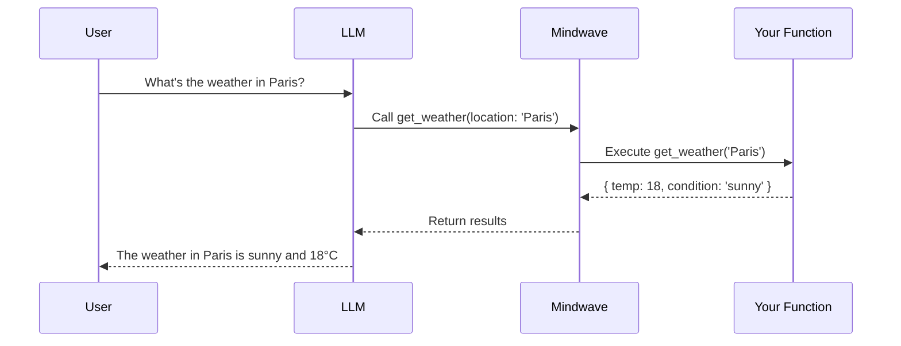

# Function Calling - Tool Use & Agentic Behavior

Function calling, also known as tool use, enables LLMs to execute specific functions in your Laravel application. This powerful capability allows models to interact with your data, perform calculations, call APIs, and take actions autonomously—turning static text generation into dynamic, agentic behavior.

## Overview

Function calling bridges the gap between LLM reasoning and real-world actions. Instead of only generating text, the model can decide when and how to use tools (functions) you define, inspect the results, and continue reasoning based on that information.

### What is Function Calling?

Function calling allows you to:

-   **Extend Model Capabilities** - Give the LLM access to real-time data, APIs, and computations
-   **Enable Autonomous Actions** - Let the model decide which tools to use and when
-   **Ground Responses in Facts** - Access live databases, search engines, or external services
-   **Build Agents** - Create intelligent systems that can reason, plan, and act

### How It Works

The function calling flow:

1. **Define Tools** - You provide function definitions (name, description, parameters)
2. **Model Decides** - The LLM determines if and which tools to call based on the conversation
3. **Execute Functions** - Mindwave executes the requested function with provided arguments
4. **Return Results** - Function output is sent back to the model
5. **Continue Reasoning** - The model uses the results to generate its final response



## Quick Start

### Basic Function Calling

```php
use Mindwave\Mindwave\Facades\Mindwave;
use Mindwave\Mindwave\Tools\Tool;

// Define a tool
$weatherTool = Tool::define(
    name: 'get_weather',
    description: 'Get the current weather for a location',
    parameters: [
        'location' => [
            'type' => 'string',
            'description' => 'The city name',
            'required' => true,
        ],
    ],
    handler: function (string $location) {
        // Your implementation
        return [
            'location' => $location,
            'temperature' => 22,
            'condition' => 'sunny',
        ];
    }
);

// Use with LLM
$response = Mindwave::llm()
    ->tools([$weatherTool])
    ->generateText("What's the weather in London?");

// Model automatically calls get_weather('London') and uses the result
echo $response; // "The weather in London is sunny with a temperature of 22°C"
```

### Using with PromptComposer

```php
use Mindwave\Mindwave\Facades\Mindwave;
use Mindwave\Mindwave\Tools\Tool;

$calculator = Tool::define(
    name: 'calculate',
    description: 'Perform mathematical calculations',
    parameters: [
        'expression' => [
            'type' => 'string',
            'description' => 'Math expression to evaluate',
            'required' => true,
        ],
    ],
    handler: fn($expression) => eval("return {$expression};")
);

$response = Mindwave::prompt()
    ->section('system', 'You are a helpful assistant with access to a calculator')
    ->section('user', 'What is 15% of 250?')
    ->tools([$calculator])
    ->run();

echo $response->content;
```

## Defining Tools

### Simple Tool Definition

```php
use Mindwave\Mindwave\Tools\Tool;

$tool = Tool::define(
    name: 'search_database',
    description: 'Search for users in the database',
    parameters: [
        'query' => [
            'type' => 'string',
            'description' => 'Search query',
            'required' => true,
        ],
    ],
    handler: function (string $query) {
        return User::where('name', 'like', "%{$query}%")->get();
    }
);
```

### Tool with Multiple Parameters

```php
$emailTool = Tool::define(
    name: 'send_email',
    description: 'Send an email to a user',
    parameters: [
        'to' => [
            'type' => 'string',
            'description' => 'Recipient email address',
            'required' => true,
        ],
        'subject' => [
            'type' => 'string',
            'description' => 'Email subject line',
            'required' => true,
        ],
        'body' => [
            'type' => 'string',
            'description' => 'Email body content',
            'required' => true,
        ],
    ],
    handler: function (string $to, string $subject, string $body) {
        Mail::to($to)->send(new GenericEmail($subject, $body));
        return ['status' => 'sent', 'to' => $to];
    }
);
```

### Tool with Enum Parameters

```php
$userTool = Tool::define(
    name: 'get_user_info',
    description: 'Get information about a user',
    parameters: [
        'user_id' => [
            'type' => 'integer',
            'description' => 'The user ID',
            'required' => true,
        ],
        'info_type' => [
            'type' => 'string',
            'description' => 'Type of information to retrieve',
            'enum' => ['profile', 'orders', 'preferences'],
            'required' => true,
        ],
    ],
    handler: function (int $userId, string $infoType) {
        $user = User::findOrFail($userId);

        return match($infoType) {
            'profile' => $user->profile,
            'orders' => $user->orders,
            'preferences' => $user->preferences,
        };
    }
);
```

## Tool Classes

For complex tools, use dedicated classes:

```php
use Mindwave\Mindwave\Tools\Tool;

class DatabaseSearchTool extends Tool
{
    public function name(): string
    {
        return 'search_database';
    }

    public function description(): string
    {
        return 'Search the product database for items matching criteria';
    }

    public function parameters(): array
    {
        return [
            'query' => [
                'type' => 'string',
                'description' => 'Search query for products',
                'required' => true,
            ],
            'category' => [
                'type' => 'string',
                'description' => 'Optional category filter',
                'required' => false,
            ],
            'max_price' => [
                'type' => 'number',
                'description' => 'Maximum price filter',
                'required' => false,
            ],
        ];
    }

    public function handle(string $query, ?string $category = null, ?float $maxPrice = null): array
    {
        $results = Product::where('name', 'like', "%{$query}%");

        if ($category) {
            $results->where('category', $category);
        }

        if ($maxPrice) {
            $results->where('price', '<=', $maxPrice);
        }

        return $results->limit(10)->get()->toArray();
    }
}

// Usage
$response = Mindwave::llm()
    ->tools([new DatabaseSearchTool()])
    ->generateText("Show me laptops under $1000");
```

## Common Tool Patterns

### 1. Database Access Tool

```php
use Mindwave\Mindwave\Tools\Tool;

class UserLookupTool extends Tool
{
    public function name(): string
    {
        return 'lookup_user';
    }

    public function description(): string
    {
        return 'Find user information by email or ID';
    }

    public function parameters(): array
    {
        return [
            'identifier' => [
                'type' => 'string',
                'description' => 'User email or ID',
                'required' => true,
            ],
        ];
    }

    public function handle(string $identifier): array
    {
        $user = is_numeric($identifier)
            ? User::find($identifier)
            : User::where('email', $identifier)->first();

        if (!$user) {
            return ['error' => 'User not found'];
        }

        return [
            'id' => $user->id,
            'name' => $user->name,
            'email' => $user->email,
            'created_at' => $user->created_at->toDateString(),
        ];
    }
}
```

### 2. API Integration Tool

```php
class WeatherAPITool extends Tool
{
    public function name(): string
    {
        return 'get_weather';
    }

    public function description(): string
    {
        return 'Get current weather information for any location';
    }

    public function parameters(): array
    {
        return [
            'location' => [
                'type' => 'string',
                'description' => 'City name or coordinates',
                'required' => true,
            ],
        ];
    }

    public function handle(string $location): array
    {
        $response = Http::get('https://api.weather.com/v1/current', [
            'location' => $location,
            'key' => config('services.weather.key'),
        ]);

        return $response->json();
    }
}
```

### 3. Calculation Tool

```php
class CalculatorTool extends Tool
{
    public function name(): string
    {
        return 'calculate';
    }

    public function description(): string
    {
        return 'Evaluate mathematical expressions safely';
    }

    public function parameters(): array
    {
        return [
            'expression' => [
                'type' => 'string',
                'description' => 'Mathematical expression (e.g., "2 + 2", "sqrt(16)")',
                'required' => true,
            ],
        ];
    }

    public function handle(string $expression): mixed
    {
        // Sanitize and evaluate safely
        $allowed = ['0-9', '+', '-', '*', '/', '(', ')', '.', ' ', 'sqrt', 'pow'];
        $clean = preg_replace('/[^0-9+\-*\/().\s]/', '', $expression);

        try {
            return eval("return {$clean};");
        } catch (\Throwable $e) {
            return ['error' => 'Invalid expression'];
        }
    }
}
```

### 4. File Operations Tool

```php
class FileReadTool extends Tool
{
    public function name(): string
    {
        return 'read_file';
    }

    public function description(): string
    {
        return 'Read contents of a file from storage';
    }

    public function parameters(): array
    {
        return [
            'path' => [
                'type' => 'string',
                'description' => 'File path relative to storage directory',
                'required' => true,
            ],
        ];
    }

    public function handle(string $path): array
    {
        $fullPath = storage_path($path);

        if (!File::exists($fullPath)) {
            return ['error' => 'File not found'];
        }

        return [
            'content' => File::get($fullPath),
            'size' => File::size($fullPath),
            'modified' => File::lastModified($fullPath),
        ];
    }
}
```

## Multi-Tool Agents

Combine multiple tools for complex agent behavior:

```php
use Mindwave\Mindwave\Facades\Mindwave;

class CustomerServiceAgent
{
    protected array $tools;

    public function __construct()
    {
        $this->tools = [
            new UserLookupTool(),
            new OrderSearchTool(),
            new RefundProcessTool(),
            new EmailSenderTool(),
        ];
    }

    public function handleRequest(string $customerQuery): string
    {
        return Mindwave::prompt()
            ->section('system', 'You are a customer service agent. Use available tools to help customers.')
            ->section('user', $customerQuery)
            ->tools($this->tools)
            ->run()
            ->content;
    }
}

// Usage
$agent = new CustomerServiceAgent();
$response = $agent->handleRequest(
    "I need a refund for order #12345 for user john@example.com"
);

// Agent will:
// 1. Call lookup_user('john@example.com')
// 2. Call search_order('12345')
// 3. Call process_refund(orderId: 12345)
// 4. Call send_email() to confirm
// 5. Generate response with all details
```

## Tool Execution Control

### Manual Tool Approval

```php
use Mindwave\Mindwave\Facades\Mindwave;
use Mindwave\Mindwave\Tools\ToolExecutionMode;

$response = Mindwave::llm()
    ->tools([$dangerousTool])
    ->toolExecutionMode(ToolExecutionMode::MANUAL)
    ->generateText("Delete all test users");

// Model generates tool calls but doesn't execute
foreach ($response->toolCalls as $call) {
    echo "Model wants to call: {$call->name}({$call->arguments})\n";

    // You decide whether to execute
    if (userApproves($call)) {
        $result = $call->execute();
    }
}
```

### Parallel Tool Execution

```php
// Model can call multiple tools simultaneously
$response = Mindwave::llm()
    ->tools([
        new WeatherTool(),
        new NewsTool(),
        new StockTool(),
    ])
    ->generateText("What's the weather, latest news, and AAPL stock price?");

// All three tools may be called in parallel
```

## Advanced Use Cases

### 1. RAG with Tool-Based Retrieval

```php
class KnowledgeRetrievalTool extends Tool
{
    public function name(): string
    {
        return 'search_knowledge_base';
    }

    public function description(): string
    {
        return 'Search the company knowledge base for relevant information';
    }

    public function parameters(): array
    {
        return [
            'query' => [
                'type' => 'string',
                'description' => 'Search query',
                'required' => true,
            ],
        ];
    }

    public function handle(string $query): array
    {
        $brain = Mindwave::brain();
        $results = $brain->search($query, count: 3);

        return collect($results)
            ->map(fn($doc) => $doc->content())
            ->toArray();
    }
}

// Agent automatically retrieves context when needed
$response = Mindwave::prompt()
    ->section('system', 'You are a helpful assistant. Use search_knowledge_base when you need information.')
    ->section('user', 'What is our return policy?')
    ->tools([new KnowledgeRetrievalTool()])
    ->run();
```

### 2. Multi-Step Workflows

```php
class WorkflowAgent
{
    public function processOrder(int $orderId): string
    {
        $tools = [
            $this->validateOrderTool(),
            $this->checkInventoryTool(),
            $this->processPaymentTool(),
            $this->shipOrderTool(),
            $this->sendConfirmationTool(),
        ];

        return Mindwave::prompt()
            ->section('system', 'Process this order step by step using available tools')
            ->section('user', "Process order #{$orderId}")
            ->tools($tools)
            ->run()
            ->content;
    }

    private function validateOrderTool(): Tool
    {
        return Tool::define(
            name: 'validate_order',
            description: 'Check if order exists and is valid',
            parameters: ['order_id' => ['type' => 'integer', 'required' => true]],
            handler: fn($orderId) => Order::find($orderId)?->toArray()
        );
    }

    // ... other tools
}
```

### 3. Dynamic Tool Generation

```php
class DynamicToolAgent
{
    public function chat(string $userId, string $message): string
    {
        $user = User::find($userId);

        // Generate tools based on user permissions
        $tools = [];

        if ($user->can('view-orders')) {
            $tools[] = new ViewOrdersTool();
        }

        if ($user->can('cancel-orders')) {
            $tools[] = new CancelOrderTool();
        }

        if ($user->isAdmin()) {
            $tools[] = new AdminDashboardTool();
        }

        return Mindwave::prompt()
            ->section('user', $message)
            ->tools($tools)
            ->run()
            ->content;
    }
}
```

## Best Practices

### 1. Clear Tool Descriptions

```php
// Bad: Vague description
Tool::define(
    name: 'get_data',
    description: 'Gets data',
    // ...
);

// Good: Specific and actionable
Tool::define(
    name: 'get_user_purchase_history',
    description: 'Retrieves complete purchase history for a specific user, including order dates, amounts, and product details',
    // ...
);
```

### 2. Comprehensive Parameter Descriptions

```php
Tool::define(
    name: 'search_products',
    description: 'Search the product catalog',
    parameters: [
        'query' => [
            'type' => 'string',
            'description' => 'Search terms (product name, SKU, or description keywords)',
            'required' => true,
        ],
        'category' => [
            'type' => 'string',
            'description' => 'Filter by category (electronics, clothing, books, etc.)',
            'enum' => ['electronics', 'clothing', 'books', 'home'],
            'required' => false,
        ],
        'max_results' => [
            'type' => 'integer',
            'description' => 'Maximum number of results to return (default: 10, max: 50)',
            'required' => false,
        ],
    ],
    handler: function ($query, $category = null, $maxResults = 10) {
        // Implementation
    }
);
```

### 3. Error Handling

```php
class RobustTool extends Tool
{
    public function handle(string $param): array
    {
        try {
            $result = $this->performOperation($param);

            return [
                'success' => true,
                'data' => $result,
            ];
        } catch (\Throwable $e) {
            Log::error('Tool execution failed', [
                'tool' => $this->name(),
                'error' => $e->getMessage(),
            ]);

            return [
                'success' => false,
                'error' => 'Failed to complete operation: ' . $e->getMessage(),
            ];
        }
    }
}
```

### 4. Rate Limiting & Safety

```php
class RateLimitedAPITool extends Tool
{
    public function handle(string $query): array
    {
        // Check rate limit
        $key = 'tool:' . $this->name() . ':' . auth()->id();

        if (RateLimiter::tooManyAttempts($key, 10)) {
            return [
                'error' => 'Rate limit exceeded. Please try again later.',
            ];
        }

        RateLimiter::hit($key, 60); // 10 calls per minute

        // Execute tool
        return $this->performAction($query);
    }
}
```

### 5. Tool Chaining

```php
// Allow tools to call other tools for complex workflows
class ChainedTool extends Tool
{
    public function handle(string $userId): array
    {
        // Step 1: Get user data
        $userTool = new UserLookupTool();
        $user = $userTool->handle($userId);

        // Step 2: Get related orders
        $orderTool = new OrderSearchTool();
        $orders = $orderTool->handle(['user_id' => $user['id']]);

        // Step 3: Calculate summary
        return [
            'user' => $user,
            'orders' => $orders,
            'total_spent' => array_sum(array_column($orders, 'total')),
        ];
    }
}
```

## Debugging & Monitoring

### Trace Tool Execution

```php
use Mindwave\Mindwave\Observability\Models\Span;

// After running agent with tools
$toolSpans = Span::where('operation_name', 'tool.execute')
    ->orderBy('created_at', 'desc')
    ->limit(10)
    ->get();

foreach ($toolSpans as $span) {
    echo "Tool: {$span->getAttribute('tool.name')}\n";
    echo "Duration: {$span->getDurationInMilliseconds()}ms\n";
    echo "Status: {$span->status_code}\n";
}
```

### Log Tool Calls

```php
class LoggingTool extends Tool
{
    public function handle(...$args): mixed
    {
        Log::info('Tool called', [
            'tool' => $this->name(),
            'arguments' => $args,
            'user' => auth()->id(),
        ]);

        $result = $this->execute(...$args);

        Log::info('Tool completed', [
            'tool' => $this->name(),
            'result_size' => strlen(json_encode($result)),
        ]);

        return $result;
    }
}
```

## Troubleshooting

### Tool Not Being Called

**Problem:** Model doesn't use your tool.

**Solutions:**

1. Improve tool description to be more specific
2. Make parameter descriptions clearer
3. Adjust system prompt to encourage tool use
4. Verify tool is in the tools array

```php
// Encourage tool usage
Mindwave::prompt()
    ->section('system', 'You MUST use the available tools to answer questions. Never guess information.')
    ->tools([$tool])
    ->run();
```

### Tool Execution Errors

**Problem:** Tool crashes during execution.

**Solutions:**

1. Add try-catch in handler
2. Validate parameters before processing
3. Return structured error responses

```php
public function handle($param): array
{
    if (empty($param)) {
        return ['error' => 'Parameter cannot be empty'];
    }

    try {
        return ['data' => $this->process($param)];
    } catch (\Throwable $e) {
        return ['error' => $e->getMessage()];
    }
}
```

## Related Documentation

-   [Tools & Agents](/docs/advanced/tools) - Advanced tool patterns
-   [PromptComposer](/docs/core/prompt-composer) - Using tools with prompts
-   [LLM Integration](/docs/core/llm) - Low-level tool calling API
-   [Tracing](/docs/core/tracing) - Monitor tool execution
