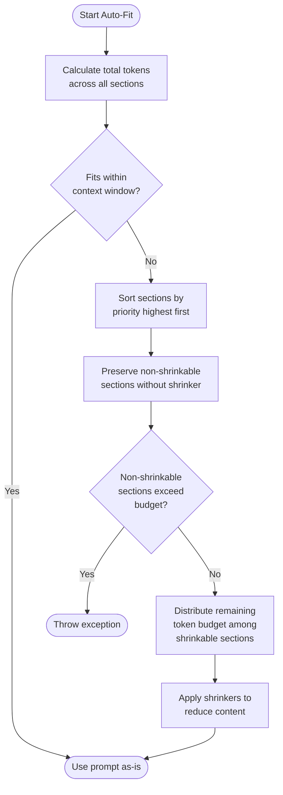

# PromptComposer

## Overview

PromptComposer is Mindwave's production-ready prompt assembly system that intelligently manages token budgets, section priorities, and content shrinking. It's designed to help you build complex prompts that automatically fit within model context windows while preserving the most critical information.

### Why PromptComposer?

In production AI applications, you often need to:

-   **Assemble prompts from multiple sources** - system instructions, user queries, context data, examples
-   **Stay within token limits** - Different models have different context windows (8K to 2M tokens)
-   **Optimize costs** - Reduce input tokens while maintaining quality
-   **Preserve critical content** - Ensure system prompts and user queries are never truncated
-   **Handle dynamic content** - Adapt to varying amounts of context data

PromptComposer solves these challenges with a priority-based auto-fit algorithm that intelligently shrinks low-priority content first, ensuring your prompts always fit while keeping what matters most.

## Installation

PromptComposer is included with Mindwave. No additional installation required.

```bash
composer require mindwave/mindwave
```

## Basic Usage

### Creating a Simple Prompt

```php
use Mindwave\Mindwave\Facades\Mindwave;

$response = Mindwave::prompt()
    ->section('system', 'You are a helpful assistant')
    ->section('user', 'What is Laravel?')
    ->run();

echo $response->content;
```

### Understanding Sections

Sections are the building blocks of your prompt. Each section has:

-   **Name** - Identifier for the section (e.g., 'system', 'user', 'context')
-   **Content** - The actual text or messages
-   **Priority** - Importance ranking (0-100, default: 50)
-   **Shrinker** - Optional strategy for reducing content (e.g., 'truncate', 'compress')
-   **Metadata** - Additional data for tracking

```php
Mindwave::prompt()
    ->section(
        name: 'system',
        content: 'You are a helpful assistant',
        priority: 100,  // High priority - won't be removed
        shrinker: null, // No shrinking - preserve exactly
        metadata: ['author' => 'admin']
    )
    ->section(
        name: 'context',
        content: $largeDocumentation,
        priority: 50,   // Medium priority - can be shrunk
        shrinker: 'truncate', // Truncate if needed
        metadata: ['source' => 'docs']
    )
    ->section(
        name: 'user',
        content: 'Explain routing in Laravel',
        priority: 100   // High priority - preserve exactly
    )
    ->run();
```

## Section Management

### Adding Sections

Sections are added in the order you define them, but output order is determined by priority:

```php
$composer = Mindwave::prompt()
    ->section('low-priority', 'This is less important', priority: 10)
    ->section('high-priority', 'This is critical', priority: 100)
    ->section('medium-priority', 'This is moderately important', priority: 50);

// Output will be ordered: high-priority, medium-priority, low-priority
```

### Section Name Mapping

Section names are automatically mapped to message roles for chat models:

```php
Mindwave::prompt()
    ->section('system', 'You are helpful')     // role: system
    ->section('user', 'Hello')                 // role: user
    ->section('assistant', 'Hi there!')        // role: assistant
    ->section('question', 'What is AI?')       // role: user
    ->section('response', 'AI is...')          // role: assistant
    ->section('custom', 'Some text');          // role: user (default)
```

### Messages Array Format

Sections can accept pre-formatted message arrays:

```php
$messages = [
    ['role' => 'system', 'content' => 'You are helpful'],
    ['role' => 'user', 'content' => 'Hello'],
];

Mindwave::prompt()
    ->section('conversation', $messages)
    ->run();
```

### Context Convenience Method

The `context()` method is a specialized section for adding contextual information with sensible defaults:

```php
// Plain text context
Mindwave::prompt()
    ->context('Laravel is a PHP framework with expressive syntax')
    ->section('user', 'What is Laravel?')
    ->run();

// Context is automatically set to priority: 50 and shrinker: 'truncate'
```

## Token Management

### The Auto-Fit Algorithm

PromptComposer's killer feature is its intelligent auto-fit algorithm. Here's how it works:



**Algorithm Steps:**

1. **Calculate total tokens** - Count tokens across all sections
2. **Check if it fits** - Compare against model's context window minus reserved output tokens
3. **If over budget**:
    - Sort sections by priority (highest first)
    - Preserve non-shrinkable sections (those without a shrinker)
    - Distribute remaining token budget among shrinkable sections
    - Apply shrinkers to reduce content
    - Throw exception if non-shrinkable sections exceed budget

**Example scenario:**

```php
use Mindwave\Mindwave\Facades\Mindwave;

// Model: GPT-4 (8,192 token context window)
// Reserved output: 1,000 tokens
// Available for input: 7,192 tokens

Mindwave::prompt()
    ->model('gpt-4')
    ->reserveOutputTokens(1000)

    // System prompt: 50 tokens, priority 100, no shrinker
    ->section('system', 'You are a Laravel expert...', priority: 100)

    // Large context: 8,000 tokens, priority 50, can shrink
    ->section('context', $largeDocumentation, priority: 50, shrinker: 'truncate')

    // User query: 20 tokens, priority 100, no shrinker
    ->section('user', 'Explain routing', priority: 100)

    ->run();

// What happens:
// 1. Non-shrinkable sections: system (50) + user (20) = 70 tokens
// 2. Remaining budget: 7,192 - 70 = 7,122 tokens
// 3. Context section gets truncated to fit within 7,122 tokens
// 4. Final prompt: 70 + 7,122 = 7,192 tokens (fits perfectly!)
```

### Manual Token Management

You can also check token counts manually:

```php
$composer = Mindwave::prompt()
    ->model('gpt-4')
    ->section('system', 'You are helpful')
    ->section('user', 'Hello');

// Get current token count
$tokens = $composer->getTokenCount();
echo "Using {$tokens} tokens";

// Get available tokens
$available = $composer->getAvailableTokens();
echo "Available: {$available} tokens";

// Check if fitted
if (!$composer->isFitted()) {
    $composer->fit();
}
```

### Reserving Output Tokens

Always reserve tokens for the model's response:

```php
Mindwave::prompt()
    ->model('gpt-4')
    ->reserveOutputTokens(500)  // Reserve 500 tokens for response
    ->section('user', 'Write a short poem about Laravel')
    ->run();
```

### Cost Optimization Example

```php
use Mindwave\Mindwave\Facades\Mindwave;

// Scenario: Analyzing large log files with Claude
// Claude 3.5 Sonnet: 200K context window
// Goal: Fit 50K tokens of logs into prompt

$logData = file_get_contents('app.log'); // Very large file

Mindwave::prompt()
    ->model('claude-3-5-sonnet-20241022')
    ->reserveOutputTokens(2000)  // Reserve for detailed analysis

    // Critical instructions - never shrink
    ->section('system', <<<EOT
        You are a log analysis expert. Analyze the logs and identify:
        - Critical errors
        - Performance bottlenecks
        - Security issues
        EOT,
        priority: 100
    )

    // Large log data - can be truncated
    ->section('logs', $logData, priority: 50, shrinker: 'truncate')

    // User query - never shrink
    ->section('user', 'Summarize critical issues', priority: 100)

    ->run();

// Result: Logs are intelligently truncated to fit, but instructions
// and query are preserved exactly.
```

## Shrinkers

Shrinkers are strategies for intelligently reducing content when it exceeds the token budget.

### Built-in Shrinkers

#### 1. Truncate Shrinker

Removes content from the end, preserving the beginning. Sentence-aware by default.

```php
$longText = "First sentence. Second sentence. Third sentence. ... (many more)";

Mindwave::prompt()
    ->section('content', $longText, shrinker: 'truncate')
    ->model('gpt-4')
    ->reserveOutputTokens(7000)  // Force truncation
    ->run();

// Result: Keeps complete sentences from the beginning until token budget is reached
```

**How it works:**

-   Splits content into sentences
-   Adds sentences one by one until token limit
-   Falls back to word-level truncation if even one sentence is too long
-   Preserves semantic coherence

**Use cases:**

-   Documentation where the beginning contains key information
-   Context where recent information is at the start
-   Structured content with most important parts first

#### 2. Compress Shrinker

Multi-stage compression that removes formatting and whitespace before truncating.

````php
$markdownDoc = <<<MD
# Heading

**Bold text** and *italic text*.

```php
// Code block
function example() {}
````

Normal text with [links](https://example.com).
MD;

Mindwave::prompt()
->section('docs', $markdownDoc, shrinker: 'compress')
->model('gpt-4')
->run();

````

**How it works (3 stages):**

1. **Remove extra whitespace**
   - Multiple newlines → single newline
   - Multiple spaces → single space
   - Tabs → spaces

2. **Remove markdown formatting**
   - Bold/italic markers (`**text**`, `_text_`)
   - Code blocks and inline code
   - Headers (`#`, `##`, etc.)
   - Links (keep text, remove URL)

3. **Truncate if still over budget**
   - Word-level truncation as last resort

**Use cases:**
- Markdown documentation
- Formatted text where formatting is not essential
- Content where structure matters more than styling

### Comparing Shrinkers

```php
$text = str_repeat("This is a test sentence. ", 1000); // Very long text

// Truncate: Fast, preserves beginning, sentence-aware
Mindwave::prompt()
    ->section('content', $text, shrinker: 'truncate')
    ->model('gpt-4')
    ->reserveOutputTokens(7000)
    ->run();
// Result: ~1,192 tokens of complete sentences from the beginning

// Compress: Slower, removes formatting first, then truncates
$formattedText = "# Header\n\n**Bold** and *italic*.\n\n" . $text;

Mindwave::prompt()
    ->section('content', $formattedText, shrinker: 'compress')
    ->model('gpt-4')
    ->reserveOutputTokens(7000)
    ->run();
// Result: Formatting removed, then ~1,192 tokens preserved
````

### Custom Shrinker Creation

Create your own shrinker by implementing the `ShrinkerInterface`:

```php
<?php

namespace App\Shrinkers;

use Mindwave\Mindwave\PromptComposer\Shrinkers\ShrinkerInterface;
use Mindwave\Mindwave\PromptComposer\Tokenizer\TokenizerInterface;

class KeepLastLinesShrinker implements ShrinkerInterface
{
    public function __construct(
        private readonly TokenizerInterface $tokenizer
    ) {}

    public function shrink(string $content, int $targetTokens, string $model): string
    {
        $currentTokens = $this->tokenizer->count($content, $model);

        // Already fits
        if ($currentTokens <= $targetTokens) {
            return $content;
        }

        // Split into lines and keep from the end
        $lines = explode("\n", $content);
        $result = [];
        $tokens = 0;

        // Iterate from last line to first
        foreach (array_reverse($lines) as $line) {
            $testContent = implode("\n", array_merge([$line], $result));
            $testTokens = $this->tokenizer->count($testContent, $model);

            if ($testTokens > $targetTokens) {
                break;
            }

            array_unshift($result, $line);
            $tokens = $testTokens;
        }

        return implode("\n", $result);
    }

    public function name(): string
    {
        return 'keep-last-lines';
    }
}
```

**Register and use your custom shrinker:**

```php
use App\Shrinkers\KeepLastLinesShrinker;
use Mindwave\Mindwave\PromptComposer\PromptComposer;
use Mindwave\Mindwave\PromptComposer\Tokenizer\TiktokenTokenizer;

$tokenizer = new TiktokenTokenizer();
$composer = new PromptComposer($tokenizer);

// Register custom shrinker
$composer->registerShrinker(
    'keep-last-lines',
    new KeepLastLinesShrinker($tokenizer)
);

// Use it
$composer
    ->section('chat-history', $longChatHistory, shrinker: 'keep-last-lines')
    ->section('user', 'What did we discuss about Laravel?')
    ->run();
```

### Shrinker Strategy Selection

Choose the right shrinker based on your content structure:

| Content Type             | Recommended Shrinker     | Reason                               |
| ------------------------ | ------------------------ | ------------------------------------ |
| Documentation, tutorials | `truncate`               | Beginning has overview/key concepts  |
| Chat history             | Custom (keep last lines) | Recent messages more relevant        |
| Markdown docs            | `compress`               | Remove formatting, save tokens       |
| Code examples            | `truncate`               | First example usually most important |
| Log files                | Custom (sample lines)    | Need representative sample           |
| Search results           | `truncate`               | Top results ranked by relevance      |

## Model Support

### Specifying Models

```php
// Method 1: Explicitly set model
Mindwave::prompt()
    ->model('gpt-4-turbo')
    ->section('user', 'Hello')
    ->run();

// Method 2: Inherit from LLM driver (recommended)
$response = Mindwave::llm('openai')  // Uses model from config
    ->prompt()
    ->section('user', 'Hello')
    ->run();
```

### Supported Models and Context Windows

PromptComposer knows the context window for all major models:

**OpenAI:**

-   `gpt-4-turbo`, `gpt-4o` - 128K tokens
-   `gpt-4` - 8K tokens
-   `gpt-4-32k` - 32K tokens
-   `gpt-3.5-turbo` - 16K tokens
-   `o1-preview`, `o1-mini` - 128K tokens

**Anthropic Claude:**

-   `claude-3-5-sonnet` - 200K tokens
-   `claude-3-opus` - 200K tokens
-   `claude-3-sonnet` - 200K tokens
-   `claude-3-haiku` - 200K tokens

**Google Gemini:**

-   `gemini-1.5-pro` - 2M tokens
-   `gemini-1.5-flash` - 1M tokens

**Mistral:**

-   `mistral-large` - 128K tokens
-   `mixtral-8x22b` - 64K tokens
-   `mixtral-8x7b` - 32K tokens

**Full list:** See `Mindwave\Mindwave\PromptComposer\Tokenizer\ModelTokenLimits::all()`

### Model Selection Example

```php
// Fitting large context with Claude's 200K window
$hugeDocs = file_get_contents('massive-documentation.txt'); // 100K tokens

Mindwave::prompt()
    ->model('claude-3-5-sonnet-20241022')
    ->reserveOutputTokens(4000)
    ->section('system', 'You are a documentation expert')
    ->section('docs', $hugeDocs, priority: 50, shrinker: 'truncate')
    ->section('user', 'Summarize the main features')
    ->run();

// With GPT-4 (only 8K tokens), docs would be heavily truncated
// With Claude (200K tokens), most docs are preserved
```

## Advanced Usage

### Conditional Sections

Add sections based on runtime conditions:

```php
$composer = Mindwave::prompt()
    ->section('system', 'You are a helpful assistant');

// Add context only if user is premium
if ($user->isPremium()) {
    $composer->section(
        'premium-context',
        'Access to exclusive features and priority support',
        priority: 75
    );
}

// Add examples for complex queries
if (strlen($userQuery) > 100) {
    $composer->section(
        'examples',
        $exampleResponses,
        priority: 60,
        shrinker: 'truncate'
    );
}

$composer
    ->section('user', $userQuery)
    ->run();
```

### Dynamic Content Assembly

```php
use Mindwave\Mindwave\Facades\Mindwave;

function buildSupportPrompt(string $userMessage, User $user): mixed
{
    $composer = Mindwave::prompt()
        ->model('gpt-4-turbo')
        ->reserveOutputTokens(500)
        ->section('system', 'You are a customer support agent', priority: 100);

    // Add user's order history if exists
    if ($user->orders->isNotEmpty()) {
        $orderContext = $user->orders->map(fn($o) =>
            "Order #{$o->id}: {$o->product} - {$o->status}"
        )->join("\n");

        $composer->section(
            'order-history',
            $orderContext,
            priority: 70,
            shrinker: 'truncate'
        );
    }

    // Add relevant KB articles
    $kbArticles = searchKnowledgeBase($userMessage);
    if ($kbArticles->isNotEmpty()) {
        $composer->section(
            'knowledge-base',
            $kbArticles->pluck('content')->join("\n\n"),
            priority: 60,
            shrinker: 'compress'
        );
    }

    // Add past conversations
    $chatHistory = $user->recentConversations()->take(5);
    if ($chatHistory->isNotEmpty()) {
        $composer->section(
            'chat-history',
            formatChatHistory($chatHistory),
            priority: 50,
            shrinker: 'truncate'
        );
    }

    // User's message is always highest priority
    $composer->section('user', $userMessage, priority: 100);

    return $composer->run();
}
```

### Integration with Context Discovery

PromptComposer seamlessly integrates with Mindwave's Context Discovery system:

```php
use Mindwave\Mindwave\Context\Sources\TntSearch\TntSearchSource;
use App\Models\Documentation;

// Create a searchable documentation source
$docsSource = TntSearchSource::fromEloquent(
    Documentation::where('published', true),
    fn($doc) => "{$doc->title}\n\n{$doc->content}"
);

// Auto-extract search query from user message
Mindwave::prompt()
    ->section('system', 'You are a Laravel expert', priority: 100)
    ->context($docsSource, priority: 60, limit: 5)  // Auto-extracts query
    ->section('user', 'How do I use Eloquent relationships?', priority: 100)
    ->run();

// Query "How do I use Eloquent relationships?" is automatically
// used to search the documentation source
```

**With multiple sources:**

```php
use Mindwave\Mindwave\Context\ContextPipeline;
use Mindwave\Mindwave\Context\Sources\VectorStoreSource;
use Mindwave\Mindwave\Context\Sources\StaticSource;

// Combine full-text search and semantic search
$tntSource = TntSearchSource::fromEloquent(Documentation::all(), fn($d) => $d->content);
$vectorSource = VectorStoreSource::from(Mindwave::brain('docs'));
$faqSource = StaticSource::fromStrings(['FAQ 1', 'FAQ 2']);

$pipeline = (new ContextPipeline)
    ->addSource($tntSource)
    ->addSource($vectorSource)
    ->addSource($faqSource);

Mindwave::prompt()
    ->section('system', 'You are helpful', priority: 100)
    ->context($pipeline, priority: 60, limit: 10)
    ->section('user', 'Explain caching in Laravel', priority: 100)
    ->run();
```

### Multiple Token Budgets

Handle different models with different budgets:

```php
function createPrompt(string $content, string $model): PromptComposer
{
    $composer = Mindwave::prompt()->model($model);

    // Adjust strategy based on model's context window
    $contextWindow = $composer->getAvailableTokens();

    if ($contextWindow > 100_000) {
        // Large context window (Claude, Gemini) - include everything
        $composer
            ->reserveOutputTokens(4000)
            ->section('system', $fullSystemPrompt, priority: 100)
            ->section('context', $allDocumentation, priority: 50, shrinker: 'truncate')
            ->section('examples', $manyExamples, priority: 40, shrinker: 'truncate');
    } else {
        // Small context window (GPT-4) - be selective
        $composer
            ->reserveOutputTokens(1000)
            ->section('system', $conciseSystemPrompt, priority: 100)
            ->section('context', $essentialDocs, priority: 50, shrinker: 'compress');
    }

    return $composer->section('user', $content, priority: 100);
}

// Usage
createPrompt($userQuery, 'claude-3-5-sonnet-20241022')->run();
createPrompt($userQuery, 'gpt-4')->run();
```

### Metadata Tracking

Track metadata for debugging and observability:

```php
$composer = Mindwave::prompt()
    ->section(
        'context',
        $searchResults,
        priority: 50,
        shrinker: 'truncate',
        metadata: [
            'source' => 'elasticsearch',
            'query' => $searchQuery,
            'result_count' => count($searchResults),
            'timestamp' => now()
        ]
    );

// Access metadata later
foreach ($composer->getSections() as $section) {
    if (isset($section->metadata['source'])) {
        Log::info('Section from: ' . $section->metadata['source']);
    }
}
```

## Output Formats

### As Messages Array

For chat-based models:

```php
$messages = Mindwave::prompt()
    ->section('system', 'You are helpful')
    ->section('user', 'Hello')
    ->toMessages();

// Result:
// [
//     ['role' => 'system', 'content' => 'You are helpful'],
//     ['role' => 'user', 'content' => 'Hello']
// ]
```

### As Plain Text

For completion models or debugging:

```php
$text = Mindwave::prompt()
    ->section('intro', 'Introduction text')
    ->section('body', 'Body content')
    ->toText();

// Result:
// "Introduction text\n\nBody content"
```

### Direct Execution

Run immediately with the configured LLM:

```php
$response = Mindwave::prompt()
    ->section('system', 'You are helpful')
    ->section('user', 'What is Laravel?')
    ->run();

echo $response->content;
```

## API Reference

### PromptComposer

#### Methods

**`section(string $name, string|array $content, int $priority = 50, ?string $shrinker = null, array $metadata = []): self`**

Add a section to the prompt.

```php
->section('system', 'You are helpful', priority: 100)
```

**`context(string|array|ContextSource|ContextPipeline $content, int $priority = 50, ?string $query = null, int $limit = 5): self`**

Add a context section. Supports plain content, ContextSource, or ContextPipeline.

```php
->context($source, priority: 60, query: 'Laravel routing', limit: 5)
```

**`model(string $model): self`**

Set the model for token counting and context window detection.

```php
->model('gpt-4-turbo')
```

**`reserveOutputTokens(int $tokens): self`**

Reserve tokens for the model's response.

```php
->reserveOutputTokens(1000)
```

**`fit(): self`**

Manually trigger the auto-fit algorithm. Called automatically by `toMessages()`, `toText()`, and `run()`.

```php
->fit()
```

**`toMessages(): array`**

Convert to messages array format for chat models.

```php
$messages = $composer->toMessages();
```

**`toText(): string`**

Convert to plain text format.

```php
$text = $composer->toText();
```

**`run(array $options = []): mixed`**

Execute the prompt with the configured LLM.

```php
$response = $composer->run(['temperature' => 0.7]);
```

**`getTokenCount(): int`**

Get the current total token count.

```php
$tokens = $composer->getTokenCount();
```

**`getAvailableTokens(): int`**

Get the available token budget (context window - reserved output tokens).

```php
$available = $composer->getAvailableTokens();
```

**`isFitted(): bool`**

Check if the prompt has been fitted.

```php
if (!$composer->isFitted()) {
    $composer->fit();
}
```

**`getSections(): array`**

Get all sections.

```php
$sections = $composer->getSections();
```

**`registerShrinker(string $name, ShrinkerInterface $shrinker): self`**

Register a custom shrinker.

```php
->registerShrinker('custom', new CustomShrinker())
```

### Section

#### Properties

-   `string $name` - Section identifier
-   `string|array $content` - Section content
-   `int $priority` - Priority (0-100)
-   `?string $shrinker` - Shrinker strategy name
-   `array $metadata` - Additional metadata

#### Methods

**`getContentAsString(): string`**

Get content as a plain string.

**`getContentAsMessages(): array`**

Get content as messages array.

**`canShrink(): bool`**

Check if section can be shrunk.

**`withContent(string|array $content): self`**

Create a copy with updated content.

**`withMetadata(array $metadata): self`**

Create a copy with merged metadata.

## Real-World Examples

### Example 1: Code Review Assistant

```php
use Mindwave\Mindwave\Facades\Mindwave;
use App\Models\CodeRepository;

function reviewPullRequest(int $prId): string
{
    $pr = PullRequest::with(['files', 'commits'])->findOrFail($prId);

    // Get recent PRs for context
    $recentPRs = PullRequest::where('repository_id', $pr->repository_id)
        ->where('status', 'merged')
        ->latest()
        ->take(5)
        ->get();

    $response = Mindwave::prompt()
        ->model('gpt-4-turbo')
        ->reserveOutputTokens(2000)

        // Coding standards - high priority, never shrink
        ->section(
            'standards',
            CodeRepository::find($pr->repository_id)->coding_standards,
            priority: 100
        )

        // Recent PR reviews for consistency - can shrink
        ->section(
            'recent-reviews',
            $recentPRs->map(fn($p) => $p->review_comments)->join("\n"),
            priority: 60,
            shrinker: 'truncate'
        )

        // The code diff - medium priority, can compress
        ->section(
            'diff',
            $pr->getDiff(),
            priority: 70,
            shrinker: 'compress'
        )

        // Review request - high priority
        ->section(
            'user',
            "Review this PR: {$pr->title}\n\nFocus on security and performance.",
            priority: 100
        )

        ->run();

    return $response->content;
}
```

### Example 2: Customer Support with Context

```php
use Mindwave\Mindwave\Facades\Mindwave;
use Mindwave\Mindwave\Context\Sources\TntSearch\TntSearchSource;
use App\Models\SupportTicket;

function handleSupportQuery(string $query, User $user): string
{
    // Search past resolved tickets
    $ticketSource = TntSearchSource::fromEloquent(
        SupportTicket::where('status', 'resolved')
            ->where('rating', '>=', 4),
        fn($t) => "Issue: {$t->title}\nSolution: {$t->resolution}"
    );

    $response = Mindwave::prompt()
        ->model('claude-3-5-sonnet-20241022')
        ->reserveOutputTokens(800)

        // Support agent persona
        ->section(
            'system',
            'You are a friendly support agent. Be concise and helpful.',
            priority: 100
        )

        // User's account info - high priority
        ->section(
            'account',
            "Account: {$user->name}\nPlan: {$user->plan}\nStatus: {$user->status}",
            priority: 90
        )

        // Past resolutions - searchable context
        ->context($ticketSource, priority: 60, limit: 3)

        // User's question
        ->section('user', $query, priority: 100)

        ->run();

    return $response->content;
}
```

### Example 3: Document Q&A with Large Context

```php
use Mindwave\Mindwave\Facades\Mindwave;

function answerDocumentQuestion(string $documentPath, string $question): string
{
    $documentContent = file_get_contents($documentPath);

    // Strategy: Use large context model and let it access full document
    $response = Mindwave::prompt()
        ->model('claude-3-5-sonnet-20241022')  // 200K context
        ->reserveOutputTokens(1000)

        ->section(
            'system',
            'Answer questions based on the provided document. Quote relevant sections.',
            priority: 100
        )

        // Entire document - will auto-fit within 200K window
        ->section(
            'document',
            $documentContent,
            priority: 70,
            shrinker: 'truncate'
        )

        ->section('user', $question, priority: 100)

        ->run();

    return $response->content;
}

// With GPT-4 (8K tokens), the document would be heavily truncated
// With Claude (200K tokens), most/all of the document is preserved
```

### Example 4: Multi-Language Documentation Search

```php
use Mindwave\Mindwave\Facades\Mindwave;
use Mindwave\Mindwave\Context\ContextPipeline;
use Mindwave\Mindwave\Context\Sources\TntSearch\TntSearchSource;

function searchDocs(string $query, string $language = 'en'): string
{
    // Create sources for different doc types
    $apiDocs = TntSearchSource::fromCsv(
        storage_path("docs/{$language}/api-reference.csv")
    );

    $tutorials = TntSearchSource::fromCsv(
        storage_path("docs/{$language}/tutorials.csv")
    );

    $faq = TntSearchSource::fromCsv(
        storage_path("docs/{$language}/faq.csv")
    );

    // Combine all sources
    $pipeline = (new ContextPipeline)
        ->addSource($apiDocs)
        ->addSource($tutorials)
        ->addSource($faq);

    $response = Mindwave::prompt()
        ->model('gpt-4-turbo')

        ->section(
            'system',
            "You are a documentation assistant. Answer in {$language}.",
            priority: 100
        )

        // Searches all sources, deduplicates, re-ranks
        ->context($pipeline, priority: 60, limit: 8)

        ->section('user', $query, priority: 100)

        ->run();

    return $response->content;
}
```

## Best Practices

### 1. Set Clear Priorities

Use the full 0-100 range to create meaningful hierarchies:

```php
Mindwave::prompt()
    ->section('system', '...', priority: 100)      // Critical - never remove
    ->section('user', '...', priority: 100)        // Critical - never remove
    ->section('examples', '...', priority: 70, shrinker: 'truncate')    // Important
    ->section('context', '...', priority: 50, shrinker: 'truncate')     // Helpful
    ->section('metadata', '...', priority: 20, shrinker: 'truncate')    // Optional
```

### 2. Always Reserve Output Tokens

Never use the full context window for input:

```php
// Bad - no room for response
->reserveOutputTokens(0)

// Good - appropriate for task
->reserveOutputTokens(500)   // Short answer
->reserveOutputTokens(2000)  // Detailed explanation
->reserveOutputTokens(4000)  // Long-form content
```

### 3. Use Appropriate Shrinkers

Match shrinker to content type:

```php
// Markdown docs - remove formatting
->section('docs', $markdown, shrinker: 'compress')

// Chat history - keep beginning for context
->section('history', $messages, shrinker: 'truncate')

// Log files - custom sampler
->section('logs', $logs, shrinker: 'sample-lines')
```

### 4. Test with Different Models

Verify your prompts work across model context sizes:

```php
// Test with small context (GPT-4: 8K)
createPrompt($content)->model('gpt-4')->run();

// Test with medium context (GPT-4 Turbo: 128K)
createPrompt($content)->model('gpt-4-turbo')->run();

// Test with large context (Claude: 200K)
createPrompt($content)->model('claude-3-5-sonnet-20241022')->run();
```

### 5. Monitor Token Usage

Track token consumption for cost optimization:

```php
$composer = Mindwave::prompt()
    ->section('system', $system)
    ->section('context', $context, shrinker: 'truncate')
    ->section('user', $user);

$beforeTokens = $composer->getTokenCount();
$composer->fit();
$afterTokens = $composer->getTokenCount();

Log::info('Token optimization', [
    'before' => $beforeTokens,
    'after' => $afterTokens,
    'saved' => $beforeTokens - $afterTokens,
    'percentage' => (($beforeTokens - $afterTokens) / $beforeTokens) * 100
]);
```

### 6. Handle Edge Cases

Protect against non-shrinkable content exceeding budget:

```php
try {
    $response = Mindwave::prompt()
        ->section('huge-system', $veryLargeSystemPrompt)  // No shrinker
        ->section('user', $query)
        ->run();
} catch (\RuntimeException $e) {
    // Non-shrinkable sections exceed budget
    // Solution: Add shrinker or split into multiple sections
    $response = Mindwave::prompt()
        ->section('system', $veryLargeSystemPrompt, shrinker: 'truncate')
        ->section('user', $query)
        ->run();
}
```

## Troubleshooting

### Issue: "Non-shrinkable sections exceed available budget"

**Cause:** Sections without shrinkers are larger than the context window.

**Solution:**

```php
// Add shrinkers to large sections
->section('large-content', $content, shrinker: 'truncate')

// Or increase reserved output tokens
->reserveOutputTokens(500)  // Instead of 2000

// Or use a model with larger context window
->model('claude-3-5-sonnet-20241022')  // 200K instead of 8K
```

### Issue: Important content being truncated

**Cause:** Priority too low or shrinker too aggressive.

**Solution:**

```php
// Increase priority
->section('important', $content, priority: 90, shrinker: 'truncate')

// Or remove shrinker entirely
->section('important', $content, priority: 100)  // No shrinker
```

### Issue: Unexpected token count

**Cause:** Different tokenizers for different models.

**Solution:**

```php
// Ensure model is set before checking token count
$composer
    ->model('gpt-4-turbo')  // Set model first
    ->section('content', $text);

echo $composer->getTokenCount();  // Accurate for gpt-4-turbo
```

### Issue: Prompt not fitting even after shrinking

**Cause:** Reserved output tokens too high or model context too small.

**Solution:**

```php
// Reduce reserved output tokens
->reserveOutputTokens(1000)  // Instead of 4000

// Or use model with larger context
->model('gpt-4-turbo')  // 128K instead of 8K
```

## Performance Considerations

### Token Counting Overhead

Token counting uses tiktoken which is fast but not free:

```php
// Efficient - count once after fitting
$composer->fit();
$tokens = $composer->getTokenCount();

// Inefficient - counting on every section add
$composer->section('1', $text1);
echo $composer->getTokenCount();  // Count
$composer->section('2', $text2);
echo $composer->getTokenCount();  // Count again
```

### Caching Encoders

Encoders are cached per encoding type, not per model:

```php
// These share the same encoder (cl100k_base)
$composer->model('gpt-4');        // Uses cl100k_base
$composer->model('gpt-4-turbo');  // Reuses cl100k_base
$composer->model('gpt-3.5-turbo'); // Reuses cl100k_base
```

### Shrinker Performance

Truncate is faster than compress:

```php
// Fast - simple truncation
->section('content', $text, shrinker: 'truncate')

// Slower - multiple regex operations
->section('content', $text, shrinker: 'compress')
```

## Further Reading

-   [Context Discovery Integration](/docs/core/context-discovery.md)
-   [Streaming SSE Responses](/docs/core/streaming.md)
-   [OpenTelemetry Tracing](/docs/core/tracing.md)
-   [LLM Driver Configuration](/docs/configuration.md)
