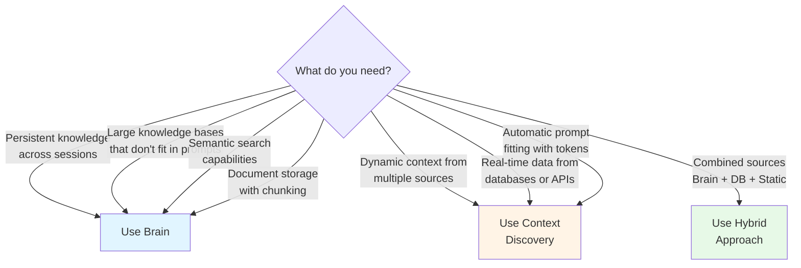

# Brain - Knowledge Management System

The Brain is Mindwave's knowledge management system that provides persistent, long-term memory for your Laravel AI applications. It combines vector embeddings with semantic search to store and retrieve knowledge efficiently.

## Overview

The Brain serves as a persistent knowledge layer that can store, index, and retrieve information using semantic similarity. Unlike short-term memory (like conversation history), the Brain is designed for long-term knowledge storage that persists across sessions and can grow indefinitely.

### What is the Brain?

The Brain is a wrapper around Mindwave's vector store system that simplifies:

-   **Knowledge Storage** - Store documents with automatic chunking and embedding
-   **Semantic Search** - Find relevant information using meaning, not just keywords
-   **Document Management** - Handle various document types (text, PDF, web pages, Word documents)
-   **Integration** - Works seamlessly with PromptComposer and Context Discovery

### Key Features

-   **Automatic Text Splitting** - Documents are automatically chunked for optimal retrieval
-   **Vector Embeddings** - Content is converted to embeddings for semantic search
-   **Multiple Backends** - Support for Pinecone, Qdrant, Weaviate, or local file storage
-   **Document Loaders** - Built-in loaders for various formats
-   **Context Integration** - Use with Context Discovery for intelligent RAG patterns

## Architecture

### How Brain Works

```
Document → Text Splitter → Chunks → Embeddings → Vector Store
                                                        ↓
Query → Embedding → Similarity Search ← Vector Store
```

1. **Ingestion**: Documents are split into chunks using text splitters
2. **Embedding**: Each chunk is converted to a vector embedding
3. **Storage**: Embeddings and content are stored in the vector store
4. **Retrieval**: Queries are embedded and matched against stored vectors
5. **Results**: Most similar chunks are returned with their original content

### Components

The Brain system consists of:

-   **Brain Class** - Main interface for storing and searching
-   **Vector Store** - Backend storage for embeddings
-   **Embeddings** - Converts text to vector representations
-   **Text Splitter** - Chunks large documents
-   **Document Loaders** - Load content from various sources

## Setup & Configuration

### Installation

The Brain is included with Mindwave. Configure your vector store in `config/mindwave-vectorstore.php`:

```php
return [
    'default' => env('MINDWAVE_VECTORSTORE', 'pinecone'),

    'vectorstores' => [
        // In-memory (testing only)
        'array' => [],

        // Local file storage
        'file' => [
            'path' => storage_path('mindwave/vectorstore.json'),
        ],

        // Pinecone (recommended for production)
        'pinecone' => [
            'api_key' => env('MINDWAVE_PINECONE_API_KEY'),
            'environment' => env('MINDWAVE_PINECONE_ENVIRONMENT'),
            'index' => env('MINDWAVE_PINECONE_INDEX'),
        ],

        // Qdrant (self-hosted option)
        'qdrant' => [
            'host' => env('MINDWAVE_QDRANT_HOST', 'localhost'),
            'port' => env('MINDWAVE_QDRANT_PORT', '6333'),
            'api_key' => env('MINDWAVE_QDRANT_API_KEY'),
            'collection' => env('MINDWAVE_QDRANT_COLLECTION', 'items'),
        ],

        // Weaviate (GraphQL-based option)
        'weaviate' => [
            'api_url' => env('MINDWAVE_WEAVIATE_URL', 'http://localhost:8080/v1'),
            'api_token' => env('MINDWAVE_WEAVIATE_API_TOKEN'),
            'index' => env('MINDWAVE_WEAVIATE_INDEX', 'items'),
        ],
    ],
];
```

### Environment Variables

Add to your `.env`:

```bash
# Choose your vector store
MINDWAVE_VECTORSTORE=pinecone

# Pinecone configuration
MINDWAVE_PINECONE_API_KEY=your-api-key
MINDWAVE_PINECONE_ENVIRONMENT=us-east-1-aws
MINDWAVE_PINECONE_INDEX=mindwave

# Or use Qdrant
# MINDWAVE_VECTORSTORE=qdrant
# MINDWAVE_QDRANT_HOST=localhost
# MINDWAVE_QDRANT_PORT=6333
# MINDWAVE_QDRANT_COLLECTION=mindwave
```

### Testing the Setup

```php
use Mindwave\Mindwave\Facades\Mindwave;
use Mindwave\Mindwave\Document\Data\Document;

// Get the Brain instance
$brain = Mindwave::brain();

// Store a simple document
$brain->consume(Document::make('Laravel is a PHP framework'));

// Search
$results = $brain->search('PHP web development', count: 5);

dump($results); // Should return relevant documents
```

## Storing Knowledge

### Basic Storage

Store a single document:

```php
use Mindwave\Mindwave\Facades\Mindwave;
use Mindwave\Mindwave\Document\Data\Document;

$brain = Mindwave::brain();

// Simple text
$brain->consume(
    Document::make('Mindwave is a production AI utility package for Laravel')
);

// With metadata
$brain->consume(
    Document::make(
        content: 'Our support email is support@example.com',
        metadata: [
            'category' => 'contact',
            'type' => 'email',
            'department' => 'support'
        ]
    )
);
```

### Batch Storage

Store multiple documents efficiently:

```php
$documents = [
    Document::make('Document 1 content', ['category' => 'docs']),
    Document::make('Document 2 content', ['category' => 'docs']),
    Document::make('Document 3 content', ['category' => 'docs']),
];

$brain->consumeAll($documents);
```

### Loading from Various Sources

The Brain works with Mindwave's document loaders:

```php
use Mindwave\Mindwave\Facades\DocumentLoader;
use Mindwave\Mindwave\Facades\Mindwave;

$brain = Mindwave::brain();

// From URL
$brain->consume(
    DocumentLoader::fromUrl('https://laravel.com/docs/11.x/installation')
);

// From PDF
$brain->consume(
    DocumentLoader::fromPdf('/path/to/document.pdf')
);

// From Word document
$brain->consume(
    DocumentLoader::fromWord('/path/to/document.docx')
);

// From plain text
$brain->consume(
    DocumentLoader::fromText('Your text content here')
);
```

### Automatic Text Chunking

The Brain automatically chunks large documents for optimal retrieval:

```php
use Mindwave\Mindwave\Brain\Brain;
use Mindwave\Mindwave\TextSplitters\RecursiveCharacterTextSplitter;

$brain = new Brain(
    vectorstore: Mindwave::vectorStore(),
    embeddings: Mindwave::embeddings(),
    textSplitter: new RecursiveCharacterTextSplitter(
        chunkSize: 1000,      // Characters per chunk
        chunkOverlap: 200     // Overlap between chunks
    )
);

// Large document will be automatically split
$brain->consume(Document::make($largeText));
```

### Metadata and Categorization

Use metadata to organize and filter knowledge:

```php
// User preferences
$brain->consume(Document::make(
    'User prefers dark mode and email notifications',
    metadata: [
        'user_id' => 123,
        'type' => 'preference',
        'updated_at' => now()
    ]
));

// Company policies
$brain->consume(Document::make(
    'Remote work is allowed up to 3 days per week',
    metadata: [
        'category' => 'policy',
        'department' => 'hr',
        'effective_date' => '2024-01-01'
    ]
));

// Product documentation
$brain->consume(Document::make(
    'The API rate limit is 1000 requests per hour',
    metadata: [
        'product' => 'api',
        'version' => '2.0',
        'section' => 'limits'
    ]
));
```

## Retrieving Knowledge

### Basic Search

Find relevant information using semantic search:

```php
$brain = Mindwave::brain();

// Search returns array of Document objects
$results = $brain->search(
    query: 'How do I authenticate users?',
    count: 5  // Number of results
);

foreach ($results as $doc) {
    echo $doc->content();      // Document content
    dump($doc->metadata());    // Associated metadata
}
```

### Semantic Understanding

The Brain finds conceptually similar content, not just keyword matches:

```php
// Query: "authentication methods"
// Will find documents containing:
// - "OAuth integration"
// - "JWT tokens"
// - "login system"
// - "user verification"
// Even without exact keyword matches
```

### Using with PromptComposer

Integrate Brain search results into your prompts:

```php
use Mindwave\Mindwave\Facades\Mindwave;

$brain = Mindwave::brain();

// 1. Search the Brain
$docs = $brain->search('user authentication', count: 3);

// 2. Build context from results
$context = collect($docs)
    ->map(fn($doc) => $doc->content())
    ->join("\n\n---\n\n");

// 3. Use in prompt
$response = Mindwave::prompt()
    ->section('system', "Use this context:\n\n{$context}")
    ->section('user', 'How do I implement login?')
    ->run();
```

### Using with Context Discovery

The Brain integrates seamlessly with Context Discovery:

```php
use Mindwave\Mindwave\Context\Sources\VectorStoreSource;
use Mindwave\Mindwave\Facades\Mindwave;

// Create a context source from Brain
$vectorSource = VectorStoreSource::fromBrain(
    brain: Mindwave::brain(),
    name: 'knowledge-base'
);

// Use in PromptComposer with automatic context injection
$response = Mindwave::prompt()
    ->context($vectorSource, query: 'user preferences')
    ->section('user', 'What are my notification settings?')
    ->run();

// The Brain is automatically searched and relevant docs are injected
```

### Advanced: Multiple Context Sources

Combine Brain with other sources:

```php
use Mindwave\Mindwave\Context\Sources\VectorStoreSource;
use Mindwave\Mindwave\Context\Sources\DatabaseSource;

// Documentation from Brain
$docsSource = VectorStoreSource::fromBrain(
    Mindwave::brain(),
    'documentation'
);

// User data from database
$userSource = DatabaseSource::query(
    User::where('id', $userId)
)->columns(['name', 'email', 'preferences']);

// Combine both
$response = Mindwave::prompt()
    ->context($docsSource, query: 'notification settings')
    ->context($userSource, query: 'user profile')
    ->section('user', 'Update my notification preferences')
    ->run();
```

## Question Answering (QA)

The Brain includes a built-in Question Answering system:

```php
use Mindwave\Mindwave\Facades\Mindwave;
use Mindwave\Mindwave\Facades\DocumentLoader;

// 1. Load knowledge into Brain
Mindwave::brain()->consumeAll([
    DocumentLoader::fromUrl('https://laravel.com/docs/11.x/authentication'),
    DocumentLoader::fromUrl('https://laravel.com/docs/11.x/authorization'),
]);

// 2. Ask questions directly
$answer = Mindwave::qa()->answerQuestion(
    'How do I implement OAuth in Laravel?'
);

echo $answer;
// Returns: "Laravel provides built-in support for OAuth through Laravel Passport..."
```

### How QA Works

The QA system:

1. Converts your question to an embedding
2. Searches the vector store for relevant content
3. Injects found content as context
4. Uses the LLM to generate an answer based on the context

### Custom QA Implementation

Build your own QA system:

```php
use Mindwave\Mindwave\Brain\QA;
use Mindwave\Mindwave\Facades\Mindwave;

$qa = new QA(
    llm: Mindwave::llm(),
    vectorstore: Mindwave::vectorStore(),
    embeddings: Mindwave::embeddings()
);

// With custom system message
$qa->systemMessageTemplate =
    'You are a helpful Laravel expert. Use the context below to answer questions. '.
    'If the answer is not in the context, say so clearly.'.
    "\n\nContext:\n{context}";

$answer = $qa->answerQuestion('What is middleware?');
```

## Use Cases

### 1. User Preferences & Settings

Store and retrieve user-specific knowledge:

```php
use Mindwave\Mindwave\Facades\Mindwave;
use Mindwave\Mindwave\Document\Data\Document;

class UserPreferencesService
{
    protected $brain;

    public function __construct()
    {
        $this->brain = Mindwave::brain();
    }

    public function storePreference(int $userId, string $preference): void
    {
        $this->brain->consume(Document::make(
            content: $preference,
            metadata: [
                'user_id' => $userId,
                'type' => 'preference',
                'stored_at' => now()->toIso8601String()
            ]
        ));
    }

    public function getUserContext(int $userId): array
    {
        return $this->brain->search(
            query: "user {$userId} preferences settings",
            count: 10
        );
    }

    public function generateResponse(int $userId, string $request): string
    {
        $prefs = $this->getUserContext($userId);

        $context = collect($prefs)
            ->map(fn($doc) => $doc->content())
            ->join("\n");

        return Mindwave::prompt()
            ->section('system', "User preferences:\n{$context}")
            ->section('user', $request)
            ->run();
    }
}

// Usage
$service = new UserPreferencesService();

$service->storePreference(123, 'Prefers email over SMS notifications');
$service->storePreference(123, 'Dark mode enabled');
$service->storePreference(123, 'Timezone: America/New_York');

$response = $service->generateResponse(
    123,
    'Send me a notification about my order'
);
// AI will use stored preferences to send email in correct timezone
```

### 2. Long-Term Conversation Memory

Persist conversation insights across sessions:

```php
use Mindwave\Mindwave\Facades\Mindwave;
use Mindwave\Mindwave\Document\Data\Document;

class ConversationMemoryService
{
    protected $brain;

    public function __construct()
    {
        $this->brain = Mindwave::brain();
    }

    public function storeFact(string $sessionId, string $fact): void
    {
        $this->brain->consume(Document::make(
            content: $fact,
            metadata: [
                'session_id' => $sessionId,
                'type' => 'learned_fact',
                'learned_at' => now()->toIso8601String()
            ]
        ));
    }

    public function chat(string $sessionId, string $message): string
    {
        // Retrieve relevant past facts
        $memories = $this->brain->search(
            query: "{$sessionId} {$message}",
            count: 5
        );

        $context = collect($memories)
            ->map(fn($doc) => "- {$doc->content()}")
            ->join("\n");

        return Mindwave::prompt()
            ->section('system', "Previous conversations:\n{$context}")
            ->section('user', $message)
            ->run();
    }

    public function extractAndStoreFacts(string $sessionId, string $conversation): void
    {
        // Use LLM to extract facts from conversation
        $facts = Mindwave::llm()->generateText(
            "Extract key facts learned about the user from this conversation. ".
            "Return as bullet points:\n\n{$conversation}"
        );

        // Store each fact
        foreach (explode("\n", $facts) as $fact) {
            if (trim($fact)) {
                $this->storeFact($sessionId, trim($fact, '- '));
            }
        }
    }
}

// Usage
$memory = new ConversationMemoryService();

// After a conversation
$memory->extractAndStoreFacts('user-123',
    "User: I'm planning a trip to Japan next month\n".
    "AI: That sounds exciting! Have you been before?\n".
    "User: No, it's my first time"
);

// Later conversation
$response = $memory->chat('user-123', 'What should I pack?');
// AI remembers the Japan trip context
```

### 3. Domain Knowledge Base

Store company policies, procedures, and documentation:

```php
use Mindwave\Mindwave\Facades\Mindwave;
use Mindwave\Mindwave\Facades\DocumentLoader;

class CompanyKnowledgeBase
{
    protected $brain;

    public function __construct()
    {
        $this->brain = Mindwave::brain();
    }

    public function indexCompanyDocs(): void
    {
        // HR Policies
        $this->brain->consumeAll([
            DocumentLoader::fromPdf(storage_path('docs/employee-handbook.pdf')),
            DocumentLoader::fromPdf(storage_path('docs/remote-work-policy.pdf')),
            DocumentLoader::fromPdf(storage_path('docs/benefits-guide.pdf')),
        ]);

        // Engineering Docs
        $this->brain->consumeAll([
            DocumentLoader::fromUrl('https://docs.company.com/api'),
            DocumentLoader::fromUrl('https://docs.company.com/architecture'),
            DocumentLoader::fromUrl('https://docs.company.com/deployment'),
        ]);
    }

    public function askHR(string $question): string
    {
        return Mindwave::qa()->answerQuestion($question);
    }

    public function search(string $query, ?string $category = null): array
    {
        return $this->brain->search($query, count: 10);
    }
}

// Usage
$kb = new CompanyKnowledgeBase();
$kb->indexCompanyDocs();

// Employees can ask questions
$answer = $kb->askHR('How many vacation days do I get?');
$answer = $kb->askHR('What is the remote work policy?');
```

### 4. Product Documentation Assistant

Create an intelligent documentation search:

```php
use Mindwave\Mindwave\Facades\Mindwave;
use Mindwave\Mindwave\Facades\DocumentLoader;
use Mindwave\Mindwave\Context\Sources\VectorStoreSource;

class DocumentationAssistant
{
    protected $brain;

    public function __construct()
    {
        $this->brain = Mindwave::brain();
    }

    public function indexDocs(array $urls): void
    {
        $documents = collect($urls)
            ->map(fn($url) => DocumentLoader::fromUrl($url))
            ->filter()
            ->toArray();

        $this->brain->consumeAll($documents);
    }

    public function help(string $question): string
    {
        $vectorSource = VectorStoreSource::fromBrain(
            $this->brain,
            'documentation'
        );

        return Mindwave::prompt()
            ->context($vectorSource, query: $question)
            ->section('system',
                'You are a helpful documentation assistant. '.
                'Answer questions using the provided context. '.
                'Include code examples when relevant.'
            )
            ->section('user', $question)
            ->run();
    }
}

// Usage
$docs = new DocumentationAssistant();

$docs->indexDocs([
    'https://laravel.com/docs/11.x/eloquent',
    'https://laravel.com/docs/11.x/queries',
    'https://laravel.com/docs/11.x/migrations',
]);

$answer = $docs->help('How do I create a many-to-many relationship?');
```

### 5. Customer Support Knowledge Base

Build an AI-powered support system:

```php
use Mindwave\Mindwave\Facades\Mindwave;
use Mindwave\Mindwave\Document\Data\Document;

class SupportAssistant
{
    protected $brain;

    public function __construct()
    {
        $this->brain = Mindwave::brain();
    }

    public function loadKnowledgeBase(): void
    {
        // Load FAQs
        $faqs = [
            [
                'q' => 'How do I reset my password?',
                'a' => 'Click "Forgot Password" on the login page and follow the email instructions.'
            ],
            [
                'q' => 'How do I cancel my subscription?',
                'a' => 'Go to Settings > Billing > Cancel Subscription. You can cancel anytime.'
            ],
            [
                'q' => 'What payment methods do you accept?',
                'a' => 'We accept all major credit cards, PayPal, and ACH transfers.'
            ],
        ];

        $documents = collect($faqs)->map(fn($faq) =>
            Document::make(
                "Q: {$faq['q']}\nA: {$faq['a']}",
                metadata: ['type' => 'faq']
            )
        );

        $this->brain->consumeAll($documents->toArray());
    }

    public function answer(string $customerQuestion): string
    {
        // Find relevant FAQs
        $relevant = $this->brain->search($customerQuestion, count: 3);

        $context = collect($relevant)
            ->map(fn($doc) => $doc->content())
            ->join("\n\n");

        return Mindwave::prompt()
            ->section('system',
                "You are a customer support assistant. Use the FAQ below to answer questions.\n\n".
                "FAQs:\n{$context}"
            )
            ->section('user', $customerQuestion)
            ->run();
    }
}

// Usage
$support = new SupportAssistant();
$support->loadKnowledgeBase();

$answer = $support->answer("I can't log in to my account");
$answer = $support->answer("Do you support Apple Pay?");
```

## Memory Management

### Updating Knowledge

The Brain uses append-only storage. To update knowledge:

```php
use Mindwave\Mindwave\Facades\Mindwave;
use Mindwave\Mindwave\Document\Data\Document;

// Option 1: Add new version with timestamp
Mindwave::brain()->consume(Document::make(
    'Support hours are now 24/7',
    metadata: [
        'category' => 'support',
        'version' => 2,
        'updated_at' => now()->toIso8601String(),
        'replaces' => 'support-hours-v1'
    ]
));

// Option 2: Clear and reload
Mindwave::vectorStore()->truncate();
Mindwave::brain()->consumeAll($updatedDocuments);
```

### Clearing the Brain

Remove all stored knowledge:

```php
use Mindwave\Mindwave\Facades\Mindwave;

// Clear all data
Mindwave::vectorStore()->truncate();

// Check item count
$count = Mindwave::vectorStore()->itemCount();
echo "Vector store has {$count} items";
```

### Versioning Strategy

Track versions in metadata:

```php
use Mindwave\Mindwave\Document\Data\Document;

$doc = Document::make(
    'Our API rate limit is 2000 requests per hour',
    metadata: [
        'section' => 'api-limits',
        'version' => '3.0',
        'effective_date' => '2024-06-01',
        'supersedes' => ['2.0', '1.0']
    ]
);

Mindwave::brain()->consume($doc);
```

### Pruning Strategies

Implement custom pruning logic:

```php
class BrainMaintenanceService
{
    public function pruneOldDocuments(int $daysToKeep = 90): void
    {
        // This is conceptual - actual implementation depends on your vector store
        $cutoffDate = now()->subDays($daysToKeep);

        // Rebuild with only recent documents
        $recentDocs = Document::where('created_at', '>=', $cutoffDate)->get();

        Mindwave::vectorStore()->truncate();

        $documents = $recentDocs->map(fn($doc) =>
            Document::make($doc->content, $doc->metadata)
        );

        Mindwave::brain()->consumeAll($documents->toArray());
    }
}
```

## Best Practices

### What to Store in Brain

**Good Candidates:**

-   Documentation and knowledge base articles
-   Product information and specifications
-   Company policies and procedures
-   FAQs and common questions
-   Historical data and insights
-   User preferences and learned facts

**Poor Candidates:**

-   Frequently changing data (use database instead)
-   Real-time information (use API calls instead)
-   Highly structured data (use database queries instead)
-   Sensitive authentication data (use proper auth systems)

### Knowledge Organization

Use consistent metadata for organization:

```php
// Good: Structured metadata
Document::make($content, [
    'category' => 'documentation',
    'product' => 'api',
    'version' => '2.0',
    'tags' => ['authentication', 'oauth', 'security'],
    'updated_at' => '2024-01-15'
]);

// Avoid: Unstructured metadata
Document::make($content, [
    'misc_data' => 'some random info'
]);
```

### Chunk Size Optimization

Choose appropriate chunk sizes:

```php
use Mindwave\Mindwave\TextSplitters\RecursiveCharacterTextSplitter;

// For detailed documentation (smaller chunks)
$detailSplitter = new RecursiveCharacterTextSplitter(
    chunkSize: 500,
    chunkOverlap: 100
);

// For general knowledge (larger chunks)
$generalSplitter = new RecursiveCharacterTextSplitter(
    chunkSize: 1500,
    chunkOverlap: 300
);
```

**Guidelines:**

-   **Small chunks (300-600)** - Precise matching, detailed docs
-   **Medium chunks (800-1200)** - General purpose, balanced
-   **Large chunks (1500-2000)** - Contextual information, summaries

### Update Strategies

Implement versioned updates:

```php
class KnowledgeUpdateService
{
    public function updatePolicy(string $id, string $newContent): void
    {
        // Store new version
        Mindwave::brain()->consume(Document::make(
            $newContent,
            metadata: [
                'id' => $id,
                'version' => $this->getNextVersion($id),
                'updated_at' => now(),
                'active' => true
            ]
        ));

        // Mark old versions as inactive (conceptual)
        // Actual implementation depends on vector store capabilities
    }
}
```

### Performance Considerations

**Optimize for Scale:**

```php
// Bad: Many individual inserts
foreach ($documents as $doc) {
    Mindwave::brain()->consume($doc); // Slow for large batches
}

// Good: Batch operations
Mindwave::brain()->consumeAll($documents); // Much faster
```

**Monitor Storage:**

```php
$count = Mindwave::vectorStore()->itemCount();
Log::info("Brain contains {$count} document chunks");

if ($count > 100000) {
    Log::warning('Brain storage getting large, consider pruning');
}
```

### Privacy and Security

**Handle Sensitive Data Carefully:**

```php
// DO: Filter sensitive information before storing
$sanitized = $this->removePII($content);
Mindwave::brain()->consume(Document::make($sanitized));

// DON'T: Store raw user data with passwords, credit cards, etc.
Mindwave::brain()->consume(Document::make($rawUserData)); // ❌
```

**Use Metadata for Access Control:**

```php
Mindwave::brain()->consume(Document::make(
    $content,
    metadata: [
        'access_level' => 'admin',
        'department' => 'engineering',
        'requires_auth' => true
    ]
));

// Implement access checks when retrieving
$results = Mindwave::brain()->search($query);
$filtered = collect($results)->filter(function($doc) {
    return $this->userHasAccess(auth()->user(), $doc->metadata());
});
```

## Brain vs Context Discovery



### When to Use Brain

Use the Brain when you need:

-   **Persistent knowledge** across sessions
-   **Large knowledge bases** that don't fit in prompts
-   **Semantic search** for finding relevant information
-   **Document storage** with automatic chunking

```php
// Brain: For stored knowledge
$brain = Mindwave::brain();
$brain->consumeAll($documentationPages);
$results = $brain->search('authentication');
```

### When to Use Context Discovery

Use Context Discovery when you need:

-   **Dynamic context** from multiple sources
-   **Real-time data** from databases or APIs
-   **Automatic prompt fitting** with token limits
-   **Combined sources** (Brain + Database + Static)

```php
// Context Discovery: For dynamic, multi-source context
use Mindwave\Mindwave\Context\Sources\{VectorStoreSource, DatabaseSource};

$response = Mindwave::prompt()
    ->context(VectorStoreSource::fromBrain(Mindwave::brain()))
    ->context(DatabaseSource::query(User::find($id)))
    ->section('user', 'What are my settings?')
    ->run();
```

### Hybrid Approach

Combine both for maximum power:

```php
use Mindwave\Mindwave\Context\Sources\VectorStoreSource;

// Brain stores long-term knowledge
Mindwave::brain()->consumeAll($knowledgeBase);

// Context Discovery pulls from Brain + other sources
$response = Mindwave::prompt()
    ->context(
        VectorStoreSource::fromBrain(Mindwave::brain()),
        query: 'user preferences'
    )
    ->context(
        DatabaseSource::query(Order::where('user_id', $userId)),
        query: 'recent orders'
    )
    ->section('user', 'What is my order status?')
    ->run();
```

## Brain vs Vector Stores

The Brain is a high-level abstraction over vector stores:

| Feature            | Brain                | Vector Store           |
| ------------------ | -------------------- | ---------------------- |
| **Level**          | High-level API       | Low-level interface    |
| **Purpose**        | Knowledge management | Vector storage         |
| **Text Splitting** | Automatic            | Manual                 |
| **Embeddings**     | Automatic            | Manual                 |
| **Use Case**       | Store & search docs  | Custom implementations |

### Direct Vector Store Access

For advanced use cases, access the vector store directly:

```php
use Mindwave\Mindwave\Facades\Mindwave;
use Mindwave\Mindwave\Vectorstore\Data\VectorStoreEntry;
use Mindwave\Mindwave\Document\Data\Document;

$vectorStore = Mindwave::vectorStore();
$embeddings = Mindwave::embeddings();

// Manual insertion with custom logic
$entry = new VectorStoreEntry(
    vector: $embeddings->embedText('Custom text'),
    document: Document::make('Custom text', ['custom' => 'metadata'])
);

$vectorStore->insert($entry);

// Manual search
$queryEmbedding = $embeddings->embedText('search query');
$results = $vectorStore->similaritySearch($queryEmbedding, count: 5);
```

## Advanced Features

### Custom Text Splitters

Implement custom chunking logic:

```php
use Mindwave\Mindwave\TextSplitters\CharacterTextSplitter;
use Mindwave\Mindwave\Brain\Brain;

// Split by custom delimiter
$splitter = new CharacterTextSplitter(
    chunkSize: 1000,
    chunkOverlap: 100,
    separator: "\n\n" // Split on double newlines
);

$brain = new Brain(
    vectorstore: Mindwave::vectorStore(),
    embeddings: Mindwave::embeddings(),
    textSplitter: $splitter
);
```

### Multi-Tenant Brain

Implement per-tenant knowledge bases:

```php
class TenantBrainService
{
    public function getBrainForTenant(int $tenantId): Brain
    {
        // Each tenant gets their own vector store instance
        $vectorStore = new FileVectorStore(
            path: storage_path("brain/tenant-{$tenantId}.json")
        );

        return new Brain(
            vectorstore: $vectorStore,
            embeddings: Mindwave::embeddings()
        );
    }

    public function search(int $tenantId, string $query): array
    {
        return $this->getBrainForTenant($tenantId)->search($query);
    }
}

// Usage
$service = new TenantBrainService();
$results = $service->search(tenantId: 42, query: 'billing info');
```

### Automatic Knowledge Extraction

Extract and store facts from conversations:

```php
use Mindwave\Mindwave\Facades\Mindwave;
use Mindwave\Mindwave\Document\Data\Document;

class KnowledgeExtractor
{
    public function extractFromConversation(string $conversation): void
    {
        $prompt =
            "Extract factual information from this conversation as bullet points. ".
            "Focus on user preferences, stated facts, and important details:\n\n".
            $conversation;

        $facts = Mindwave::llm()->generateText($prompt);

        // Store each fact
        $documents = collect(explode("\n", $facts))
            ->filter()
            ->map(fn($fact) => Document::make(
                trim($fact, '- '),
                metadata: [
                    'type' => 'extracted_fact',
                    'source' => 'conversation',
                    'extracted_at' => now()
                ]
            ))
            ->toArray();

        Mindwave::brain()->consumeAll($documents);
    }
}

// Usage
$extractor = new KnowledgeExtractor();
$extractor->extractFromConversation($chatHistory);
```

### Hybrid Search (Dense + Sparse)

Combine semantic search with keyword matching:

```php
class HybridSearchService
{
    protected $brain;

    public function __construct()
    {
        $this->brain = Mindwave::brain();
    }

    public function search(string $query, int $count = 10): array
    {
        // Semantic search from Brain
        $semanticResults = $this->brain->search($query, $count);

        // Keyword search from database
        $keywordResults = Document::search($query)
            ->take($count)
            ->get();

        // Merge and deduplicate
        return $this->mergeResults($semanticResults, $keywordResults);
    }

    protected function mergeResults(array $semantic, $keyword): array
    {
        // Implementation depends on your scoring logic
        // Combine and rank by relevance
        return array_slice(
            array_merge($semantic, $keyword->toArray()),
            0,
            10
        );
    }
}
```

## Troubleshooting

### Common Issues

**Problem: Search returns no results**

```php
// Check if Brain has data
$count = Mindwave::vectorStore()->itemCount();
if ($count === 0) {
    throw new Exception('Brain is empty. Load documents first.');
}

// Verify embeddings are working
$embedding = Mindwave::embeddings()->embedText('test');
dump($embedding); // Should show vector array
```

**Problem: Poor search quality**

```php
// Solution 1: Adjust chunk size
$brain = new Brain(
    vectorstore: Mindwave::vectorStore(),
    embeddings: Mindwave::embeddings(),
    textSplitter: new RecursiveCharacterTextSplitter(
        chunkSize: 800,     // Try smaller chunks
        chunkOverlap: 200   // Increase overlap
    )
);

// Solution 2: Return more results and filter
$results = $brain->search($query, count: 20); // Get more results
$filtered = collect($results)->take(5);        // Filter to top 5
```

**Problem: Slow performance**

```php
// Use batch operations
// Bad:
foreach ($docs as $doc) {
    Mindwave::brain()->consume($doc); // Slow
}

// Good:
Mindwave::brain()->consumeAll($docs); // Much faster

// Check vector store performance
$start = microtime(true);
$results = Mindwave::brain()->search($query);
$duration = microtime(true) - $start;
Log::info("Search took {$duration} seconds");
```

**Problem: Vector store connection errors**

```php
// Verify configuration
$config = config('mindwave-vectorstore.vectorstores.pinecone');
dump($config); // Check API keys, endpoints

// Test connection
try {
    $count = Mindwave::vectorStore()->itemCount();
    Log::info("Connection successful. {$count} items in store.");
} catch (\Exception $e) {
    Log::error("Vector store connection failed: {$e->getMessage()}");
}
```

### Performance Optimization

**Batch Processing:**

```php
// Process documents in batches
$batches = collect($documents)->chunk(100);

foreach ($batches as $batch) {
    Mindwave::brain()->consumeAll($batch->toArray());

    // Optional: Add delay to avoid rate limits
    usleep(100000); // 100ms
}
```

**Caching Search Results:**

```php
use Illuminate\Support\Facades\Cache;

class CachedBrainSearch
{
    public function search(string $query, int $count = 5): array
    {
        $cacheKey = "brain:search:" . md5($query);

        return Cache::remember($cacheKey, 3600, function() use ($query, $count) {
            return Mindwave::brain()->search($query, $count);
        });
    }
}
```

## Related Documentation

-   [Context Discovery](/docs/core/context-discovery) - Dynamic multi-source context
-   [PromptComposer](/docs/core/prompt-composer) - Auto-fitting prompts
-   [Document Loaders](/docs/document-loaders) - Loading various file types
-   [Vector Stores](/docs/reference/vector-stores) - Backend storage options
-   [Embeddings](/docs/reference/embeddings) - Text embedding providers

## Summary

The Brain provides a powerful, persistent knowledge layer for your Laravel AI applications:

-   **Simple API** - Easy to store and retrieve knowledge
-   **Automatic Processing** - Handles chunking and embedding
-   **Semantic Search** - Find relevant content by meaning
-   **Production Ready** - Multiple backend options (Pinecone, Qdrant, Weaviate)
-   **Integrated** - Works with Context Discovery and PromptComposer
-   **Flexible** - Supports various document types and metadata

Use the Brain to build intelligent applications that remember and learn from stored knowledge, providing context-aware responses without including everything in every prompt.
