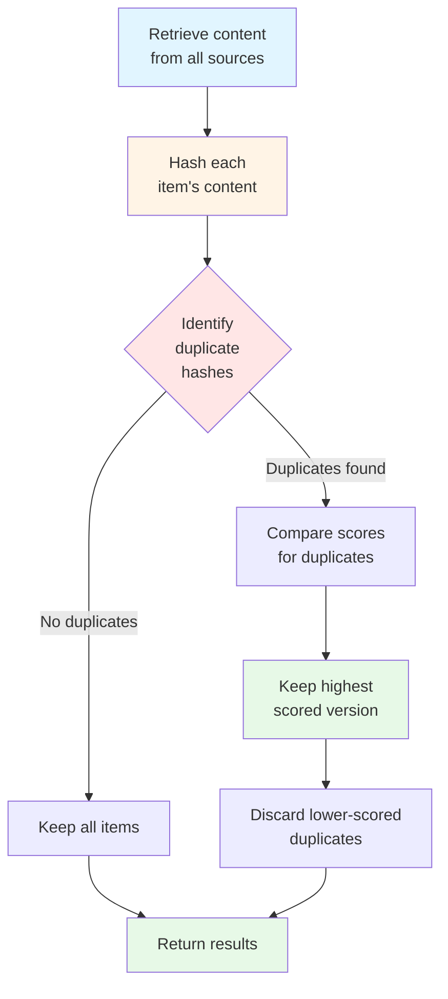
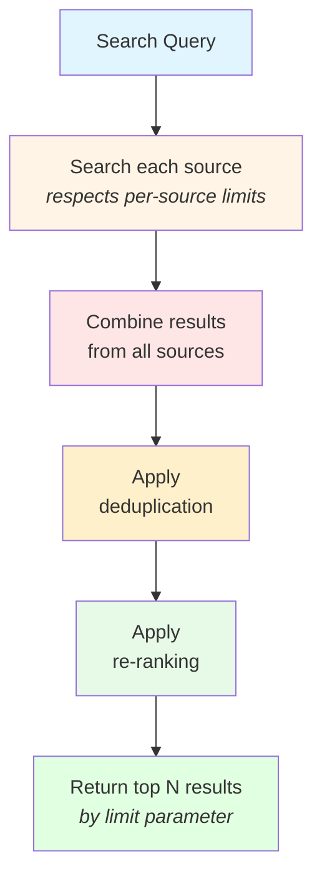

# Context Pipeline

The Context Pipeline is Mindwave's multi-source context aggregation system that enables sophisticated RAG implementations. It combines results from multiple context sources, deduplicates content, re-ranks by relevance, and automatically fits context within token limits.

## Overview

The Context Pipeline solves a common RAG challenge: how to efficiently retrieve and combine relevant information from multiple heterogeneous sources while respecting token limits and maintaining high relevance.

### What is a Context Pipeline?

A Context Pipeline orchestrates the retrieval of information from multiple sources (vector stores, full-text search, databases, static content) and intelligently combines the results into a unified context for your LLM prompts.

**Key capabilities:**

- **Multi-Source Aggregation** - Search across vector stores, TNTSearch indexes, databases, and static sources simultaneously
- **Deduplication** - Remove duplicate content across sources
- **Re-Ranking** - Sort combined results by relevance score
- **Token-Aware** - Automatically manages context size to fit within model limits
- **PromptComposer Integration** - Seamlessly integrates with Mindwave's prompt composition system

### Why Use Context Pipelines?

**Without Context Pipeline:**
```php
// Manual aggregation is complex and error-prone
$vectorResults = $vectorSource->search($query, 5);
$tntResults = $tntSource->search($query, 5);
$staticResults = $staticSource->search($query, 5);

// Manual deduplication
$seen = [];
$combined = [];
foreach (array_merge($vectorResults, $tntResults, $staticResults) as $item) {
    $hash = md5($item->content);
    if (!isset($seen[$hash])) {
        $seen[$hash] = true;
        $combined[] = $item;
    }
}

// Manual sorting
usort($combined, fn($a, $b) => $b->score <=> $a->score);

// Manual token counting and truncation
$totalTokens = 0;
$filtered = [];
foreach ($combined as $item) {
    $tokens = $this->countTokens($item->content);
    if ($totalTokens + $tokens < $maxTokens) {
        $totalTokens += $tokens;
        $filtered[] = $item;
    }
}
```

**With Context Pipeline:**
```php
// Simple, automatic aggregation
$pipeline = (new ContextPipeline)
    ->addSource($vectorSource)
    ->addSource($tntSource)
    ->addSource($staticSource)
    ->deduplicate(true)
    ->rerank(true);

$results = $pipeline->search($query, limit: 10);
// Automatically deduplicated, ranked, and ready to use
```

## Setup

### Basic Pipeline Creation

Create a pipeline with multiple context sources:

```php
use Mindwave\Mindwave\Context\ContextPipeline;
use Mindwave\Mindwave\Context\Sources\VectorStoreSource;
use Mindwave\Mindwave\Context\Sources\TntSearch\TntSearchSource;
use Mindwave\Mindwave\Context\Sources\StaticSource;
use Mindwave\Mindwave\Facades\Mindwave;

// Create individual sources
$vectorSource = VectorStoreSource::fromBrain(
    Mindwave::brain('documentation'),
    name: 'docs-semantic'
);

$tntSource = TntSearchSource::fromArray([
    'Laravel provides Eloquent ORM for database access',
    'Vue.js is a progressive JavaScript framework',
    'Docker containers package applications with dependencies',
], name: 'docs-keyword');

$staticSource = StaticSource::fromStrings([
    'Support hours: Monday-Friday, 9 AM - 5 PM EST',
    'Contact email: support@example.com',
]);

// Build pipeline
$pipeline = (new ContextPipeline)
    ->addSource($vectorSource)
    ->addSource($tntSource)
    ->addSource($staticSource)
    ->deduplicate(true)
    ->rerank(true);
```

### Pipeline Configuration

Configure pipeline behavior:

```php
use Mindwave\Mindwave\Context\ContextPipeline;

$pipeline = (new ContextPipeline)
    ->addSource($source1)
    ->addSource($source2)

    // Enable/disable deduplication (default: true)
    ->deduplicate(true)

    // Enable/disable re-ranking by score (default: true)
    ->rerank(true);
```

**Configuration Options:**

| Option | Type | Default | Description |
|--------|------|---------|-------------|
| `deduplicate` | bool | true | Remove duplicate content across sources |
| `rerank` | bool | true | Sort results by relevance score |

## Usage Examples

### Basic Pipeline Search

Search across all sources in the pipeline:

```php
use Mindwave\Mindwave\Context\ContextPipeline;

$pipeline = (new ContextPipeline)
    ->addSource($vectorSource)
    ->addSource($tntSource);

// Search returns ContextItem collection
$results = $pipeline->search('user authentication', limit: 10);

foreach ($results as $item) {
    echo "Score: {$item->score}\n";
    echo "Source: {$item->source}\n";
    echo "Content: {$item->content}\n";
    echo "---\n";
}
```

### Integration with PromptComposer

Use pipelines with PromptComposer for automatic context injection:

```php
use Mindwave\Mindwave\Facades\Mindwave;

$pipeline = (new ContextPipeline)
    ->addSource($vectorSource)
    ->addSource($tntSource)
    ->addSource($staticSource);

$response = Mindwave::prompt()
    ->section('system', 'You are a helpful assistant.')
    ->context($pipeline, query: 'password reset', limit: 5, priority: 75)
    ->section('user', 'How do I reset my password?')
    ->reserveOutputTokens(500)
    ->fit()
    ->run();

echo $response->content;
```

### Hybrid Search (Vector + Keyword)

Combine semantic and keyword search for comprehensive retrieval:

```php
use Mindwave\Mindwave\Context\ContextPipeline;
use Mindwave\Mindwave\Context\Sources\VectorStoreSource;
use Mindwave\Mindwave\Context\Sources\TntSearch\TntSearchSource;
use Mindwave\Mindwave\Facades\Mindwave;
use App\Models\Article;

// Vector search - finds conceptually similar content
$vectorSource = VectorStoreSource::fromBrain(
    Mindwave::brain('articles'),
    name: 'articles-semantic'
);

// Keyword search - finds exact term matches
$tntSource = TntSearchSource::fromEloquent(
    Article::where('published', true),
    fn($article) => "{$article->title}\n\n{$article->content}",
    name: 'articles-keyword'
);

// Combine both approaches
$pipeline = (new ContextPipeline)
    ->addSource($vectorSource)    // Semantic understanding
    ->addSource($tntSource)        // Exact matches
    ->deduplicate(true)            // Remove overlaps
    ->rerank(true);                // Best results first

$response = Mindwave::prompt()
    ->context($pipeline, query: 'laravel authentication')
    ->section('user', 'How do I implement OAuth in Laravel?')
    ->run();
```

**Benefits of Hybrid Search:**

- **Semantic matches** - Finds "OAuth", "JWT", "login" for query "authentication"
- **Keyword matches** - Finds exact phrase "Laravel authentication"
- **Complementary coverage** - Each approach covers the other's blind spots
- **Better recall** - More comprehensive retrieval
- **Deduplicated** - No redundant results

### Multi-Domain Search

Search across different knowledge domains:

```php
use Mindwave\Mindwave\Context\ContextPipeline;
use Mindwave\Mindwave\Context\Sources\VectorStoreSource;
use Mindwave\Mindwave\Context\Sources\StaticSource;
use Mindwave\Mindwave\Facades\Mindwave;

// Technical documentation
$techDocs = VectorStoreSource::fromBrain(
    Mindwave::brain('technical-docs'),
    name: 'tech-docs'
);

// Company policies
$policies = VectorStoreSource::fromBrain(
    Mindwave::brain('policies'),
    name: 'policies'
);

// FAQs (static content)
$faqs = StaticSource::fromStrings([
    'Q: What are our support hours? A: Monday-Friday, 9 AM - 5 PM EST',
    'Q: How do I contact support? A: Email support@example.com',
    'Q: What payment methods do you accept? A: Visa, Mastercard, PayPal',
], name: 'faqs');

// Combine all domains
$pipeline = (new ContextPipeline)
    ->addSource($techDocs)
    ->addSource($policies)
    ->addSource($faqs);

// Search across all domains
$response = Mindwave::prompt()
    ->context($pipeline, query: 'vacation policy')
    ->section('user', 'How many vacation days do I get?')
    ->run();

// Pipeline automatically searches tech docs, policies, and FAQs
```

### Source-Specific Result Filtering

Filter results by source after retrieval:

```php
$pipeline = (new ContextPipeline)
    ->addSource($vectorSource)
    ->addSource($tntSource)
    ->addSource($staticSource);

$results = $pipeline->search('authentication', limit: 20);

// Filter by source name
$vectorResults = $results->filter(fn($item) => $item->source === 'docs-semantic');
$tntResults = $results->filter(fn($item) => $item->source === 'docs-keyword');

// Filter by score threshold
$highQuality = $results->filter(fn($item) => $item->score > 0.8);

// Combine filters
$relevantVectorResults = $results->filter(function($item) {
    return $item->source === 'docs-semantic' && $item->score > 0.7;
});
```

### Dynamic Pipeline Construction

Build pipelines dynamically based on query or context:

```php
class SmartPipelineBuilder
{
    public function buildForQuery(string $query, array $options = []): ContextPipeline
    {
        $pipeline = new ContextPipeline();

        // Always include vector search for semantic understanding
        $pipeline->addSource(VectorStoreSource::fromBrain(
            Mindwave::brain('general'),
            name: 'general-semantic'
        ));

        // Add keyword search for specific queries
        if ($this->needsKeywordSearch($query)) {
            $pipeline->addSource($this->getKeywordSource());
        }

        // Add domain-specific sources
        if ($domain = $this->detectDomain($query)) {
            $pipeline->addSource($this->getDomainSource($domain));
        }

        // Add static FAQs for common questions
        if ($this->isCommonQuestion($query)) {
            $pipeline->addSource($this->getFaqSource());
        }

        return $pipeline
            ->deduplicate(true)
            ->rerank(true);
    }

    private function needsKeywordSearch(string $query): bool
    {
        // Check for technical terms, IDs, version numbers
        return preg_match('/\b(v?\d+\.\d+|\w+-\d+|[A-Z]{2,})\b/', $query);
    }

    private function detectDomain(string $query): ?string
    {
        $domains = [
            'billing' => ['payment', 'invoice', 'subscription', 'charge'],
            'technical' => ['api', 'code', 'error', 'debug', 'configuration'],
            'hr' => ['vacation', 'leave', 'policy', 'employee', 'benefits'],
        ];

        foreach ($domains as $domain => $keywords) {
            foreach ($keywords as $keyword) {
                if (stripos($query, $keyword) !== false) {
                    return $domain;
                }
            }
        }

        return null;
    }

    private function isCommonQuestion(string $query): bool
    {
        $patterns = ['how do i', 'what is', 'where can', 'when does'];
        foreach ($patterns as $pattern) {
            if (stripos(strtolower($query), $pattern) === 0) {
                return true;
            }
        }
        return false;
    }
}

// Usage
$builder = new SmartPipelineBuilder();
$pipeline = $builder->buildForQuery('How do I configure OAuth?');

$response = Mindwave::prompt()
    ->context($pipeline)
    ->section('user', 'How do I configure OAuth?')
    ->run();
```

## Configuration

### Deduplication

Remove duplicate content across sources:

```php
$pipeline = (new ContextPipeline)
    ->addSource($source1)
    ->addSource($source2)
    ->deduplicate(true);  // Enable deduplication

$results = $pipeline->search('query', limit: 10);
// Duplicates automatically removed
```

**How Deduplication Works:**



**Process Steps:**

1. Content from all sources is retrieved
2. Each item's content is hashed
3. Duplicate hashes are identified
4. For duplicates, the version with the highest score is kept
5. Lower-scored duplicates are discarded

**Example:**

```php
// Source 1 returns:
// - "Laravel is a framework" (score: 0.95)
// - "PHP programming language" (score: 0.80)

// Source 2 returns:
// - "Laravel is a framework" (score: 0.75)  // Duplicate!
// - "Vue.js frontend framework" (score: 0.85)

// After deduplication:
// - "Laravel is a framework" (score: 0.95)  // Kept highest score
// - "Vue.js frontend framework" (score: 0.85)
// - "PHP programming language" (score: 0.80)
```

### Re-Ranking

Sort combined results by relevance score:

```php
$pipeline = (new ContextPipeline)
    ->addSource($source1)
    ->addSource($source2)
    ->rerank(true);  // Enable re-ranking

$results = $pipeline->search('query', limit: 10);
// Results sorted by score descending
```

**Without Re-Ranking:**
```php
// Results in source order (may not be optimal)
$pipeline->rerank(false);
$results = $pipeline->search('query', 10);

// Result order:
// 1. Source 1, item 1 (score: 0.75)
// 2. Source 1, item 2 (score: 0.90)
// 3. Source 2, item 1 (score: 0.85)
// 4. Source 2, item 2 (score: 0.95)  // Best result is last!
```

**With Re-Ranking:**
```php
// Results sorted by relevance
$pipeline->rerank(true);
$results = $pipeline->search('query', 10);

// Result order:
// 1. Source 2, item 2 (score: 0.95)  // Best result first
// 2. Source 1, item 2 (score: 0.90)
// 3. Source 2, item 1 (score: 0.85)
// 4. Source 1, item 1 (score: 0.75)
```

### Limit Control

Control total number of results across all sources:

```php
$pipeline = (new ContextPipeline)
    ->addSource($source1)  // Could return 100 results
    ->addSource($source2)  // Could return 100 results
    ->addSource($source3); // Could return 100 results

// Limit total results to 10 (across all sources)
$results = $pipeline->search('query', limit: 10);
// Returns top 10 results after deduplication and ranking

// Without limit, could return up to 300 results
$allResults = $pipeline->search('query', limit: 1000);
```

**How Limits Work:**



**Process Steps:**

1. Each source is searched (respects per-source limits if set)
2. Results are combined from all sources
3. Deduplication is applied
4. Re-ranking is applied
5. The top N results (by limit parameter) are returned

## Best Practices

### 1. Source Ordering Strategy

Add sources in order of specificity:

```php
// Good: Specific to general
$pipeline = (new ContextPipeline)
    ->addSource($domainSpecificSource)    // Most specific
    ->addSource($companyPolicySource)     // Company-specific
    ->addSource($generalKnowledgeSource); // General fallback

// This ordering helps with:
// - Better deduplication (specific content kept over general)
// - Efficient searching (specific sources checked first)
// - Relevance (domain-specific results prioritized)
```

### 2. Appropriate Deduplication

Enable deduplication when using multiple sources:

```php
// Always enable when combining sources
$pipeline = (new ContextPipeline)
    ->addSource($vectorSource)
    ->addSource($tntSource)
    ->deduplicate(true);  // Essential for multi-source

// Only disable for very specific use cases
$pipeline = (new ContextPipeline)
    ->addSource($singleSource)
    ->deduplicate(false);  // OK for single source
```

### 3. Re-Ranking for Quality

Always enable re-ranking for best results:

```php
// Good: Re-rank for best results first
$pipeline = (new ContextPipeline)
    ->addSource($source1)
    ->addSource($source2)
    ->rerank(true);  // Best results first

// Bad: Results in arbitrary order
$pipeline = (new ContextPipeline)
    ->addSource($source1)
    ->addSource($source2)
    ->rerank(false);  // Avoid this
```

### 4. Optimal Limit Setting

Choose appropriate limits based on use case:

```php
// Chatbot/Q&A: Small limit for focused context
$pipeline->search($query, limit: 3);  // 3 most relevant

// Documentation search: Medium limit for comprehensive coverage
$pipeline->search($query, limit: 10); // 10 results

// Research/analysis: Larger limit for exhaustive retrieval
$pipeline->search($query, limit: 25); // 25 results

// Avoid excessive limits (wastes tokens, costs, time)
$pipeline->search($query, limit: 100); // Usually too many
```

### 5. Token-Aware Context Usage

Let PromptComposer manage context size:

```php
// Good: Token-aware with fit()
$response = Mindwave::prompt()
    ->section('system', $systemPrompt, priority: 100)
    ->context($pipeline, limit: 20, priority: 75)  // May be truncated
    ->section('user', $userQuery, priority: 100)
    ->reserveOutputTokens(500)
    ->fit()  // Automatically manages context
    ->run();

// Bad: Manual token management
$results = $pipeline->search($query, limit: 20);
$context = $results->map(fn($r) => $r->content)->join("\n");
// No automatic token management, may exceed limits
```

### 6. Pipeline Reusability

Create reusable pipelines for common patterns:

```php
class PipelineFactory
{
    public static function createDocumentationPipeline(): ContextPipeline
    {
        return (new ContextPipeline)
            ->addSource(VectorStoreSource::fromBrain(
                Mindwave::brain('docs'),
                name: 'docs-semantic'
            ))
            ->addSource(TntSearchSource::fromEloquent(
                Documentation::published(),
                fn($doc) => $doc->content,
                name: 'docs-keyword'
            ))
            ->deduplicate(true)
            ->rerank(true);
    }

    public static function createSupportPipeline(): ContextPipeline
    {
        return (new ContextPipeline)
            ->addSource(VectorStoreSource::fromBrain(
                Mindwave::brain('support'),
                name: 'support-tickets'
            ))
            ->addSource(StaticSource::fromStrings([
                'Support hours: Mon-Fri 9-5 EST',
                'Contact: support@example.com',
            ], name: 'support-info'))
            ->deduplicate(true)
            ->rerank(true);
    }
}

// Usage
$docsPipeline = PipelineFactory::createDocumentationPipeline();
$supportPipeline = PipelineFactory::createSupportPipeline();
```

### 7. Monitoring Pipeline Performance

Track pipeline search performance:

```php
use Illuminate\Support\Facades\Log;

$start = microtime(true);

$results = $pipeline->search($query, limit: 10);

$duration = microtime(true) - $start;
$sourceCount = count($pipeline->getSources());

Log::info('Pipeline search completed', [
    'query' => $query,
    'sources' => $sourceCount,
    'results' => count($results),
    'duration_ms' => round($duration * 1000, 2),
]);

if ($duration > 1.0) {
    Log::warning('Slow pipeline search', [
        'query' => $query,
        'duration' => $duration,
    ]);
}
```

### 8. Error Handling

Gracefully handle source failures:

```php
use Mindwave\Mindwave\Context\ContextPipeline;

class RobustPipelineBuilder
{
    public function buildWithErrorHandling(): ContextPipeline
    {
        $pipeline = new ContextPipeline();

        // Add sources with error handling
        try {
            $pipeline->addSource($vectorSource);
        } catch (\Exception $e) {
            Log::error('Vector source failed', ['error' => $e->getMessage()]);
            // Pipeline continues with other sources
        }

        try {
            $pipeline->addSource($tntSource);
        } catch (\Exception $e) {
            Log::error('TNT source failed', ['error' => $e->getMessage()]);
            // Pipeline continues with other sources
        }

        // Always have a fallback
        $pipeline->addSource($staticFallbackSource);

        return $pipeline
            ->deduplicate(true)
            ->rerank(true);
    }
}
```

## Advanced Patterns

### Pattern 1: Tiered Retrieval

Implement tiered retrieval with fallbacks:

```php
class TieredPipeline
{
    public function search(string $query, int $minResults = 3): Collection
    {
        // Tier 1: High-precision sources
        $pipeline1 = (new ContextPipeline)
            ->addSource($domainSpecificSource)
            ->addSource($curatedSource);

        $results = $pipeline1->search($query, limit: 10);

        if (count($results) >= $minResults) {
            return $results;
        }

        // Tier 2: Broader search
        $pipeline2 = (new ContextPipeline)
            ->addSource($domainSpecificSource)
            ->addSource($curatedSource)
            ->addSource($generalSource);  // Add general source

        $results = $pipeline2->search($query, limit: 15);

        if (count($results) >= $minResults) {
            return $results;
        }

        // Tier 3: Exhaustive search
        $pipeline3 = (new ContextPipeline)
            ->addSource($domainSpecificSource)
            ->addSource($curatedSource)
            ->addSource($generalSource)
            ->addSource($archiveSource);  // Add archived content

        return $pipeline3->search($query, limit: 20);
    }
}
```

### Pattern 2: Weighted Source Combination

Adjust result scores based on source trust:

```php
class WeightedPipeline
{
    public function search(string $query, int $limit = 10): Collection
    {
        $pipeline = (new ContextPipeline)
            ->addSource($officialDocsSource)
            ->addSource($communitySource)
            ->addSource($blogSource);

        $results = $pipeline->search($query, limit: $limit * 2);

        // Apply source-based weights
        $weighted = $results->map(function ($item) {
            $weights = [
                'official-docs' => 1.5,  // Boost official docs
                'community' => 1.0,       // Neutral
                'blog' => 0.8,            // Slight penalty
            ];

            $weight = $weights[$item->source] ?? 1.0;
            $item->score = $item->score * $weight;

            return $item;
        });

        // Re-sort by weighted scores
        return $weighted->sortByDesc('score')->take($limit);
    }
}
```

### Pattern 3: Domain-Specific Routing

Route queries to domain-specific pipelines:

```php
class DomainRouter
{
    public function search(string $query): Collection
    {
        $domain = $this->detectDomain($query);

        $pipeline = match ($domain) {
            'technical' => $this->getTechnicalPipeline(),
            'billing' => $this->getBillingPipeline(),
            'hr' => $this->getHRPipeline(),
            default => $this->getGeneralPipeline(),
        };

        return $pipeline->search($query, limit: 10);
    }

    private function getTechnicalPipeline(): ContextPipeline
    {
        return (new ContextPipeline)
            ->addSource($technicalDocsSource)
            ->addSource($apiReferenceSource)
            ->addSource($codeExamplesSource);
    }

    private function getBillingPipeline(): ContextPipeline
    {
        return (new ContextPipeline)
            ->addSource($billingPoliciesSource)
            ->addSource($pricingSource)
            ->addSource($invoiceTemplatesSource);
    }

    private function getHRPipeline(): ContextPipeline
    {
        return (new ContextPipeline)
            ->addSource($employeeHandbookSource)
            ->addSource($benefitsSource)
            ->addSource($policySource);
    }

    private function getGeneralPipeline(): ContextPipeline
    {
        return (new ContextPipeline)
            ->addSource($generalKnowledgeSource)
            ->addSource($faqSource);
    }
}
```

### Pattern 4: Contextual Source Selection

Select sources based on user context:

```php
class ContextualPipeline
{
    public function buildForUser(User $user, string $query): ContextPipeline
    {
        $pipeline = new ContextPipeline();

        // Always include general knowledge
        $pipeline->addSource($generalSource);

        // Add role-specific sources
        if ($user->isAdmin()) {
            $pipeline->addSource($adminDocsSource);
        }

        if ($user->isDeveloper()) {
            $pipeline->addSource($technicalDocsSource);
            $pipeline->addSource($apiReferenceSource);
        }

        // Add department-specific sources
        if ($department = $user->department) {
            $pipeline->addSource($this->getDepartmentSource($department));
        }

        // Add user's subscribed topics
        foreach ($user->subscribedTopics as $topic) {
            $pipeline->addSource($this->getTopicSource($topic));
        }

        return $pipeline
            ->deduplicate(true)
            ->rerank(true);
    }
}
```

## Performance Optimization

### 1. Limit Per-Source Results

Control how many results each source returns:

```php
// If sources support per-source limits
$vectorSource = VectorStoreSource::fromBrain(
    Mindwave::brain('docs'),
    name: 'docs'
)->withLimit(10);  // Limit this source to 10 results

$tntSource = TntSearchSource::fromArray($docs, name: 'keyword')
    ->withLimit(10);  // Limit this source to 10 results

$pipeline = (new ContextPipeline)
    ->addSource($vectorSource)  // Max 10 from vector
    ->addSource($tntSource);    // Max 10 from TNT

// Pipeline returns max 20 results (before dedup/ranking)
$results = $pipeline->search($query, limit: 15);
```

### 2. Parallel Source Execution

Execute source searches in parallel (if supported):

```php
// Mindwave automatically optimizes source execution
// No special configuration needed
$pipeline = (new ContextPipeline)
    ->addSource($slowVectorSource)   // 200ms
    ->addSource($fastTNTSource)      // 50ms
    ->addSource($staticSource);      // 10ms

// Total time ≈ 200ms (parallel) vs 260ms (sequential)
$results = $pipeline->search($query, limit: 10);
```

### 3. Caching Pipeline Results

Cache common queries:

```php
use Illuminate\Support\Facades\Cache;

class CachedPipeline
{
    public function search(string $query, int $limit = 10): Collection
    {
        $cacheKey = "pipeline:search:" . md5($query) . ":{$limit}";

        return Cache::remember($cacheKey, 3600, function () use ($query, $limit) {
            return $this->pipeline->search($query, $limit);
        });
    }
}
```

### 4. Source Selection Optimization

Only add sources that are likely to be relevant:

```php
class OptimizedPipeline
{
    public function buildForQuery(string $query): ContextPipeline
    {
        $pipeline = new ContextPipeline();

        // Always add primary source
        $pipeline->addSource($primarySource);

        // Conditionally add expensive sources
        if ($this->queryNeedsSemanticSearch($query)) {
            $pipeline->addSource($vectorSource);  // Expensive
        }

        if ($this->queryNeedsKeywordSearch($query)) {
            $pipeline->addSource($tntSource);     // Fast
        }

        return $pipeline
            ->deduplicate(true)
            ->rerank(true);
    }
}
```

## Troubleshooting

### Problem: Duplicate Results

**Symptom:** Same content appears multiple times in results

**Solution:**

```php
// Ensure deduplication is enabled
$pipeline = (new ContextPipeline)
    ->addSource($source1)
    ->addSource($source2)
    ->deduplicate(true);  // Enable deduplication

$results = $pipeline->search($query, limit: 10);
```

### Problem: Poor Relevance

**Symptom:** Most relevant results not appearing first

**Solution:**

```php
// Enable re-ranking
$pipeline = (new ContextPipeline)
    ->addSource($source1)
    ->addSource($source2)
    ->rerank(true);  // Sort by score

$results = $pipeline->search($query, limit: 10);

// Or manually filter by score threshold
$relevant = $results->filter(fn($item) => $item->score > 0.7);
```

### Problem: Too Few Results

**Symptom:** Pipeline returns fewer results than expected

**Solutions:**

```php
// 1. Increase limit
$results = $pipeline->search($query, limit: 20);  // Instead of 10

// 2. Add more sources
$pipeline->addSource($additionalSource);

// 3. Check individual source results
foreach ($pipeline->getSources() as $source) {
    $sourceResults = $source->search($query, 10);
    dump("Source {$source->getName()}: " . count($sourceResults) . " results");
}

// 4. Disable deduplication temporarily to see total available
$pipeline->deduplicate(false);
$allResults = $pipeline->search($query, limit: 100);
dump("Total results without dedup: " . count($allResults));
```

### Problem: Slow Performance

**Symptom:** Pipeline searches take too long

**Solutions:**

```php
// 1. Profile individual sources
foreach ($pipeline->getSources() as $source) {
    $start = microtime(true);
    $source->search($query, 10);
    $duration = microtime(true) - $start;
    Log::info("Source {$source->getName()}: {$duration}s");
}

// 2. Remove slow sources if not critical
$pipeline = (new ContextPipeline)
    ->addSource($fastSource1)
    ->addSource($fastSource2);
    // Remove $slowSource3

// 3. Reduce per-source limits
$source->withLimit(5);  // Instead of 10

// 4. Cache pipeline results
$cacheKey = md5($query);
$results = Cache::remember($cacheKey, 3600,
    fn() => $pipeline->search($query, 10)
);
```

### Problem: Empty Results

**Symptom:** Pipeline returns no results for valid query

**Solutions:**

```php
// 1. Check if sources have data
foreach ($pipeline->getSources() as $source) {
    $count = $source->getItemCount();  // If available
    Log::info("Source {$source->getName()} has {$count} items");
}

// 2. Test each source individually
$vectorResults = $vectorSource->search($query, 10);
$tntResults = $tntSource->search($query, 10);
dump("Vector: " . count($vectorResults));
dump("TNT: " . count($tntResults));

// 3. Try broader query
$results = $pipeline->search('general query', limit: 10);

// 4. Check deduplication impact
$pipeline->deduplicate(false);
$results = $pipeline->search($query, limit: 10);
```

## Testing

### Unit Testing Pipelines

Test pipeline behavior in isolation:

```php
use Tests\TestCase;
use Mindwave\Mindwave\Context\ContextPipeline;
use Mindwave\Mindwave\Context\Sources\StaticSource;

class ContextPipelineTest extends TestCase
{
    /** @test */
    public function it_combines_results_from_multiple_sources()
    {
        $source1 = StaticSource::fromStrings([
            'Laravel is a PHP framework',
            'Vue.js is a JavaScript framework',
        ], name: 'source1');

        $source2 = StaticSource::fromStrings([
            'Docker is a containerization platform',
            'Laravel is a PHP framework',  // Duplicate
        ], name: 'source2');

        $pipeline = (new ContextPipeline)
            ->addSource($source1)
            ->addSource($source2)
            ->deduplicate(true)
            ->rerank(true);

        $results = $pipeline->search('framework', limit: 10);

        // Should have 3 unique results (duplicate removed)
        $this->assertCount(3, $results);

        // Results should be sorted by score
        $this->assertGreaterThanOrEqual(
            $results[1]->score,
            $results[0]->score
        );
    }

    /** @test */
    public function it_respects_result_limit()
    {
        $source = StaticSource::fromStrings([
            'Result 1', 'Result 2', 'Result 3',
            'Result 4', 'Result 5', 'Result 6',
        ]);

        $pipeline = (new ContextPipeline)->addSource($source);

        $results = $pipeline->search('Result', limit: 3);

        $this->assertCount(3, $results);
    }

    /** @test */
    public function it_deduplicates_content_across_sources()
    {
        $source1 = StaticSource::fromStrings([
            'Duplicate content',
            'Unique content 1',
        ], name: 'source1');

        $source2 = StaticSource::fromStrings([
            'Duplicate content',  // Same as source1
            'Unique content 2',
        ], name: 'source2');

        $pipeline = (new ContextPipeline)
            ->addSource($source1)
            ->addSource($source2)
            ->deduplicate(true);

        $results = $pipeline->search('content', limit: 10);

        // Should have 3 results (1 duplicate removed)
        $this->assertCount(3, $results);
    }
}
```

### Integration Testing

Test pipelines with real sources:

```php
use Tests\TestCase;
use Mindwave\Mindwave\Context\ContextPipeline;
use Mindwave\Mindwave\Context\Sources\VectorStoreSource;
use Mindwave\Mindwave\Context\Sources\TntSearch\TntSearchSource;
use Mindwave\Mindwave\Facades\Mindwave;

class PipelineIntegrationTest extends TestCase
{
    /** @test */
    public function it_retrieves_relevant_context_for_query()
    {
        // Setup test data
        $brain = Mindwave::brain('test');
        $brain->consumeAll([
            Document::make('Laravel provides Eloquent ORM'),
            Document::make('Vue.js is a frontend framework'),
        ]);

        $vectorSource = VectorStoreSource::fromBrain($brain);
        $tntSource = TntSearchSource::fromArray([
            'Laravel routing system',
            'Vue.js component system',
        ]);

        $pipeline = (new ContextPipeline)
            ->addSource($vectorSource)
            ->addSource($tntSource);

        // Test search
        $results = $pipeline->search('Laravel database', limit: 5);

        $this->assertGreaterThan(0, $results->count());
        $this->assertStringContainsString('Laravel', $results->first()->content);
    }
}
```

## Related Documentation

- [RAG Overview](/docs/rag/overview) - Complete RAG architecture and concepts
- [TNTSearch Source](/docs/rag/tntsearch-source) - Full-text search source
- [Vector Store Source](/docs/rag/vector-store-source) - Semantic search source
- [Custom Sources](/docs/rag/custom-sources) - Build custom context sources
- [PromptComposer](/docs/core/prompt-composer) - Token-aware prompt composition
